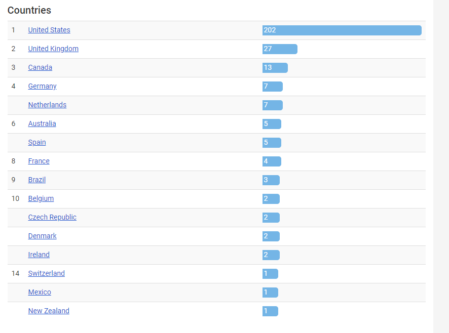

```{r, echo=FALSE}
dat <- read.csv("inputs/alex_g_stats_8_1.csv", stringsAsFactors = F)
```


## Preface
I don't know under what context you might be looking at this html, but hello I'm Tim. I'm writing this preface so that no matter where you're coming from I can explain waht you're about to see.

### What is this?
  This is a data analysis I completed on some survey data I collected from a Facebook group known as (Sandy) Alex G 666posting. For those of you that don't know, Alex G is a prolific indie artist who has been putting out music since at least 2010. His popularity has only continued to grow with each album release, but what makes him such an interesting musician is, including his leaked unreleased tracks, Alex has 200+ songs, which to me is impressive.
  
  I joined the group back in Jan of 2019 as I got into Alex's unreleased discography and have come to really enjoy the community that exists there. One day an individual, Zion, asked how old they were when they started listening to Alex G and how old they were now. I asked if it was okay, collected that data, and made a figure for the group showing the distribution of ages and other ones as well. I then asked if it was okay to make a survey for the group to analyze more data, I got the okay, specifically from Isabelle, and began working. Many individuals helped with the survey as you can see in the bottom, but the result was `r ncol(dat)` columns of data from `r round(nrow(dat), 3)` individuals. Some questions Alex G related, some not. But I hope you find something interesting in this little project I made. I've been working on it on and off in my free time since... April I think? Either way its a labor of love to give back to the great community I found online. The group is full of cool people and I'm glad to be a part of it (I also think this project helped me become a mod so that was nice).
  
### Disclaimer
  At the time of me writing this 666posting is at the cusp of reaching 3,000 members. That's great, but we need to talk about sample size, because that means we only have ~`r nrow(dat)/3000*100`% of the group accounted for. Not only that, but as this is an optional survey, one must be aware of the type of people who would take the time to fill out said survey. This is not an unbiased slice of the group, but I do like to think this includes the core group of active individuals (idk I didn't ask for names). So with that in mind, let's get into the analysis.


## Libraries used

+ `tidyverse`: Used for general exploratory analysis, primarily used dplyr within it
+ `ztablel`: Used to make various tables
+ `UpSetR`: Used to make Upset plots
+ `wordcloud`: Used to make wordclouds (surprise!)
+ `rworldmap`: The map of the world!
+ `mapproj`: The map of... US?
+ `maps`: More maps... I gotta clean this up
+ `viridis`: Used for colorblind friendly palletes
+ `rstatix`: Ummmm
+ `EnvStats`: Used to get the N on ggplots for groupings
+ `ggpubr`: Arranging the plots

### Seed
`set.seed(123)` This was just to keep consistency of the wordcloud

```{r setup, include=FALSE}
knitr::opts_chunk$set(echo = TRUE, warning = FALSE, message = FALSE)
library(tidyverse)
library(ztable)
library(UpSetR)
library(wordcloud)
library(rworldmap)
library(mapproj)
library(wesanderson)
library(maps)
library(viridis)
library(rstatix)
library(EnvStats)
library(ggpubr)
library(gridExtra)
library(reshape2)
library(scales)
options(ztable.type = "html")
#For simulated p-values
set.seed(123)
```

## Loading the data and prepping functions
```{r}
dat <- read.csv("inputs/alex_g_stats_8_1.csv", stringsAsFactors = F)

#functions
hi_low_fact <- function(x, decrease = F){
  names(table(x)[order(table(x), decreasing = decrease)])
}

auto_ztable <- function(df, col1, col2, title, simul_p = F, pval_digits = 3, marg = 0) {
  temp_tab <- table(df[[col1]], df[[col2]])
  temp_ztab <- ztable(temp_tab)
  chi_result <- chisq.test(df[[col1]], df[[col2]], simulate.p.value = simul_p)
  temp_ztab %>% makeHeatmap(margin = marg) %>%
  print(caption = paste0(title," ; Chi-Sqare p-value of ", format.pval(chi_result$p.value, digits = pval_digits)))
}

to_zcore <- function(x){
  (x - mean(x))/sd(x)
}

```

# Demographics questions

Data clean for demographics
```{r}
dat <- dat %>% mutate(
  race = str_to_title(race),
  orientation = str_to_title(orientation),
  gender = factor(gender, hi_low_fact(gender, decrease = F)),
  transgender = factor(transgender, levels = c("No", "Yes", "Prefer not to answer")),
  polyamorous = ifelse(polyamorous == "Prefer not to say", "Prefer not to answer", polyamorous),
  polyamorous = factor(polyamorous, levels = c("No", "Yes", "Prefer not to answer")),
  generation = ifelse(generation == "", "Prefer not to say", generation)
)
```


  So the first demographics we'll take a quick peak at is at age and race. First we'll look at age at a histogram colored on "what generation do you identify with". Get used to the age varaible, as it is one of our few numerical values, so I'm going to be plotting it a lot. Anyways, overall age is right skewed, with only one real outlier at `r max(dat$age)`. Alex G is about 26-27 at the time of me writing this and has been writing music since his early teenage years, so the demographics of teens and 20-somethings is unsurprising.
  
  As a straight white dude (who we will see is the average Alex G listener), I can't really speak to why or why not Alex is popular or not popular with the other demographics, and frankly I'm not sure it is my place to speculate. As a result for race, gender, trans identity, and polyamory I will let you draw your own conclusions. I just don't feel I as an individual should be speaking didactically about such a subject.
  
```{r, fig.width=10, fig.height=8}
#Age
age_plot <- ggplot(dat, aes(age, fill = generation)) +
  geom_histogram(breaks=seq(15, 45, by=1), color = "black")+
  ylab("Count") +
  xlab("Age") +
  theme_classic() +
  scale_x_continuous(breaks = round(seq(min(dat$age), max(dat$age), by = 5)/5) * 5)

age_summary <- round(t(as.matrix(summary(dat$age))), digits = 2)

rownames(age_summary) <- "Age"

age_summ_table <- ggtexttable(age_summary)


#Race plot
race_dat <- dat %>% count(race)


race_plot <- ggplot(race_dat, aes(race, n)) +
  geom_bar(stat = "identity") +
  coord_flip() +
  theme_classic() +
  geom_text(aes(label=n), nudge_y = 2.5) +
  ylab("Count") +
  xlab("Race")


  
  
dem_plot <- ggarrange(age_plot, age_summ_table, race_plot, nrow = 3,
                      heights = c(1, .3, 1))

annotate_figure(dem_plot, top = text_grob(
  "Age and Race of individuals in 666posting"
))
```

```{r, fig.width=8, fig.height=12}
#gender plot
gender_plot <- ggplot(dat, aes(gender, fill = gender)) +
  geom_bar() +
  coord_flip() +
  theme_classic() +
  theme(legend.position="bottom") +
  geom_text(stat='count', aes(label=..count..), nudge_y = 2.5)
  
#gender_plot

#trans identity plot
trans_dat <- filter(dat, transgender != "") %>% select(age, transgender)
trans_plot <-  ggplot(trans_dat, aes(transgender)) + geom_bar() +
  coord_flip()+
  theme_classic() +
  geom_text(stat='count', aes(label=..count..), nudge_y = 4)

#trans_plot

#orientation plot
orientation_totals <- dat %>% group_by(orientation) %>%
  count(orientation)


orientation_plot <-  ggplot(dat, aes(orientation, fill = gender)) +
  geom_bar(position = "dodge") +
  coord_flip() +
  theme_classic() +
  theme(legend.position="bottom")+
  geom_text(stat='count',
            aes(label=..count..),
            position = position_dodge(width = 1),
            hjust = -.08,
            size = 4)
    #geom_text(aes(orientation, n, label = n, fill = NULL), data = orientation_totals, nudge_y = 4)

#polyamorous identity plot
poly_totals <- dat %>% group_by(polyamorous) %>%
  count(polyamorous)

poly_plot <-  ggplot(dat, aes(polyamorous, fill = gender)) +
  geom_bar(position = "Dodge") +
  coord_flip() +
  theme(legend.position = "none") +
  theme_classic() +
  geom_text(stat='count', aes(label=..count..), position = position_dodge(width = 1), hjust = -.08)
 #   geom_text(aes(polyamorous, n, label = n, fill = NULL), data = poly_totals, nudge_y = 4)

#poly_plot


gpt_plot <- ggarrange(gender_plot, orientation_plot,
                      poly_plot, trans_plot,
                      nrow = 4, common.legend = T,
                      heights = c(.4, 1.5, 1, .8))


annotate_figure(gpt_plot, top = text_grob(
  "Gender count, polyamory colored on gender, and trans identity"
))

```

# The plot that started it all
This is a plot I had inspired this project, how? Quick story time:

Zion, a memeber of 666posting asked individuals "What age were you when you discovered Alex G and what age are you now?". Everyone started answering the question and I found it interesting. Eventually it had over 200+ individuals and I came up with an idea on making two overlapping histograms of people ages of learning about Alex G and their current age. I asked for permission and then I began the first analysis of 666posting. As you'll see I didn't stop there with that data since I thought of other things to do with it, but this eventually led to me asking if I could run a survey which leads to this whole R markdown. So really Zion inspired me to do this, so if you're reading this, thanks dude!

One of the data points I make sure to make is the year learned people learned about Alex G, using the fact this survey was done in 2020 as a reference. This will be used later
```{r}
##Two histograms

dat <- dat %>% mutate(difference = age - first_age, year_learned = 2020 - difference)

#melt_dat <- melt(dat %>% select(-difference, -year_learned))
melt_dat <- melt(dat %>% select(age, first_age))


#get mean
start_mean <- mean(dat$first_age)
start_median <- median(dat$first_age)

end_mean <- mean(dat$age)
end_median <- median(dat$age)

sum_dat <- NULL
sum_dat$mean <- c(end_mean, start_mean)
sum_dat$median <- c(end_median, start_median)
sum_dat$group <- factor(c("end", "start"), levels = c("start", "end"))
sum_dat <- as.data.frame(sum_dat)

# Interweaved histograms
ggplot(melt_dat, aes(x=value, fill=variable)) +
  geom_histogram(position="identity", alpha=0.5, color = "black" ,
                 #bins = (max(melt_dat$value) - min(melt_dat$value)
                  binwidth = 1)+
  
  scale_x_continuous(breaks=seq(min(melt_dat$value),max(melt_dat$value),2)) +   
  #geom_vline(data=sum_dat, aes(xintercept=mean, color=group), size = 1.5,
            # linetype="dashed")+
    #geom_vline(data=sum_dat, aes(xintercept=median, color=group), size = 1.5,
             #linetype="dashed") +
  geom_vline(xintercept = c(end_median, start_median), size = 1.8,
             linetype="dashed", color = c("royalblue3","red3")) +
  annotate(geom="text", vjust = 1.7, size = 3.5, x = c(35),
           y = c(13.1, 16), label = c("Current Age Median", "Starting Age Median")) +
   geom_segment(aes(x = 32, y = 15.5, xend = 38, yend = 15.5),
                linetype="dashed", size = 1.5, color = "red3")+
   geom_segment(aes(x = 32, y = 12.5, xend = 38, yend = 12.5),
                linetype="dashed", size = 1.5, color = "royalblue3")+
  labs(title = "Age of Finding Alex G and Current Age", subtitle = "Overlapping Histogram", y = "# of Individuals", x = "Age", legend = "") +
  scale_fill_discrete(name = "",labels=c("Current Age", "Starting Listening Age")) +
  theme_classic(base_size = 13) + theme(legend.position="top")
ggsave("start_age_current.png", width = 9, height = 7)

```

Another plot I made, using the aformentioned "year learning of Alex G" data I extrapolated is a diagram of his growht. However, unlike my initial making of this plot based on people just commenting on a Facebook post, this data is a little... odd. 
```{r}
##Second histogram
fact_order <- as.character(sort(unique(dat$year_learned)))


##Add album years
race = 2010
winner = 2011
Rules_Trick = 2012
DSU = 2014
beach_music = 2015
rocket = 2017
HoS = 2019


dat_2 <- (dat %>% select(year_learned))

ggplot(dat_2, aes(x=year_learned)) +
  geom_histogram(color = "black",  fill = "grey", binwidth = 1)+
    scale_x_continuous(breaks=seq(2009,2020,2)) +
  
  geom_vline(xintercept = race, linetype="dotted", 
                color = "deeppink1", size=1.5) +
   geom_vline(xintercept = winner, 
                color = "yellow3", size=1.5, linetype ="dotted") + 
  geom_vline(xintercept = Rules_Trick, 
                color = "deepskyblue1", size= 1.5, linetype ="dotted") +
    geom_vline(xintercept = DSU, 
                color = "springgreen4", size= 1.5, linetype ="dotted") +
      geom_vline(xintercept = beach_music, 
                color = "royalblue4", size= 1.5, linetype ="dotted") +
        geom_vline(xintercept = rocket, 
                color = "red3", size= 1.5, linetype ="dotted")  +
          geom_vline(xintercept = HoS, 
                color = "darkorchid4", size= 1.5, linetype ="dotted") + 
  annotate(geom="text", angle = 90, vjust = 1.3, size = 5,  
           x=c(race, winner, Rules_Trick, DSU, beach_music, rocket, HoS), 
           y=c(10, 10, 10, 10, 10, 10, 10), 
           label=c("Race", "Winner", "Rules/Trick", "DSU", "Beach Music", "Rocket", "House of Sugar"),
              #color="red"
           color = c("deeppink", "yellow3", "deepskyblue1", "springgreen4", "royalblue4", "red3", "darkorchid4")
           ) +
          labs(title = "Histogram of when people first heard of Alex G", x = "Year First Heard", y = "# of Individuals") +
  theme_classic(base_size = 13)

ggsave("year_start_listening.png", width = 9, height = 7)

```
So below is the original figure.

 (FIGURE)
 
 And compared to this figure our new one is definitely different. First of all we we have much more of a normal distribution besides the person... who first heard Alex G in '07. Frankly I'm a little dubious and would be interested in hearing that story. The individual did not identify which state they live in, so I thought my worries would be assuaged by hearing they lived in PA, but alas, I have no idea. The other interesting aspect is our first non '07 fan comes in around 2011, after Race, an arguably seminal Alex G album. I would frankly be expecting a larger boost with Race, and the previous plot I made did have individuals listening around the time of Race, admittedly few, but more than none. It is important to note Alex G was making music with his band the Skin Cells during the early years as well, but that history is more murky.
 
 Also compared to the previous plot we have a lot more 2018-20 fans, but I think that's primarily because the original data was pulled from late March/early April 2020, and this current survey has been rolling open the entire year, so that is not unexpected But on the topic of the actual data, the data is for the most part normal, which is more indicative of the sample we're pulling from, as I presume should just continue increasing with each album as his fame has only grown. Maybe there is a critical limit of indie fans however that he might've reached, who knows! It is interesting that 2015 and the release of Beach Music is his largest jump in popularity, as it is also the same year he signed with Domino Records who probably helped promote his work to a wider audience.

### How long have we been listening to Alex G?


This long.
```{r}
dat_3 <- dat %>% select(difference)

ggplot(dat_3, aes(x=difference)) +
  geom_histogram(color = "black",  fill = "grey", binwidth = 1) + 
  scale_x_continuous(breaks=seq(min(dat_3$difference),max(dat_3$difference),1)) +
 # geom_vline(xintercept = mean(dat_3$difference)) +
  labs(title = "How Many Years Have We Been Listening?", x ="Length of Time in Years", y = "# of Indivduals") +
  theme_classic(base_size = 17)
  
ggsave("how_long_listening.png", width = 9, height = 7)

```

It's the previous plot inverted, what can I say. 

### Cumulative Distribution Plot of Fan Growth

I just like cumulative distribution plots, its all the same data. If you don't know how cumulative distribution plots work, basically the line shows over the years the growth of Alex's fanbase as if counting up to the total, so you can see his percentage gain each year to his current 100% of the fanbase.
```{r}

ggplot(dat, aes(x=year_learned)) + stat_ecdf() + scale_x_continuous(breaks=seq(2009,2020,2))+
  scale_y_continuous(labels = percent) +
  geom_vline(xintercept = race, linetype="dotted", 
                color = "deeppink1", size=1.5) +
   geom_vline(xintercept = winner, 
                color = "yellow3", size=1.5, linetype ="dotted") + 
  geom_vline(xintercept = Rules_Trick, 
                color = "deepskyblue1", size= 1.5, linetype ="dotted") +
    geom_vline(xintercept = DSU, 
                color = "springgreen4", size= 1.5, linetype ="dotted") +
      geom_vline(xintercept = beach_music, 
                color = "royalblue4", size= 1.5, linetype ="dotted") +
        geom_vline(xintercept = rocket, 
                color = "red3", size= 1.5, linetype ="dotted")  +
          geom_vline(xintercept = HoS, 
                color = "darkorchid4", size= 1.5, linetype ="dotted") + 
  annotate(geom="text", angle = 90, vjust = 1.3, size = 5,  
           x=c(race, winner, Rules_Trick, DSU, beach_music, rocket, HoS), 
           y=c(.10, .20, .30, .50, .80, .60, .75), 
           label=c("Race", "Winner", "Rules/Trick", "DSU", "Beach Music", "Rocket", "House of Sugar"),
              #color="red"
           color = c("deeppink", "yellow3", "deepskyblue1", "springgreen4", "royalblue4", "red3", "darkorchid4")
           ) +
          labs(title = "How has Alex G's Fanbase Grown?",subtitle = "Cummulative Distribution Plot of Alex G Fanbase Growth", x ="Year", y = "Percent of Current Fanbase") +
  theme_classic(base_size = 13)


ggsave("alex_g_fanbase_growth.png", width = 9, height = 7)


```

# Make a map of the world

 So Alex G, for those not in the know, lives in Philly. But, like most successful artists, people want to see him perform in other cities and he tours pretty regularly. So I thought it would be interesting to see where Alex G fans are all over the world!


Preparing and loading data
```{r}


country_codes <- read.csv("inputs/countrycode.csv", stringsAsFactors = F)

#Get a count of fans per each country
world_dat <- as.data.frame(table(dat$country), stringsAsFactors = F)
 
colnames(world_dat) <- c("Country.Name", "fans")
#Join with official data
world_dat  <- left_join(country_codes, world_dat)
 
world_needed <- world_dat %>% select(fans, ISO2, ISO3, Country.Name) 

#colors
pal <- wes_palette("Zissou1", 100, type = "continuous")
 
 
#Get a higher resolution
worldmap <- getMap(resolution = "low")

worldmap@data <- left_join(worldmap@data, world_needed)
worldmap_poly <- fortify(worldmap)
worldmap_poly <- merge(worldmap_poly, worldmap@data, by.x="id", by.y="ADMIN", all.x=T)

#Make fans per 100,000
worldmap_poly <- worldmap_poly %>% mutate(fans_per = ifelse(is.na(fans), 0, fans),
                                        fans_per = round((fans/POP_EST * 100000), digits = 3))
#Remove the US because they have to many individuals
worldmap_poly_nUSA <- worldmap_poly %>% filter(Country.Name != "United States")
```


## Plotting the world

A simple plot of the whole world colored on fans per 100,000 individuals in each of those countries.
```{r}
#Whole world with US
ggplot() + 
  coord_map(xlim = c(-180, 180), ylim = c(-60, 75))  +
  geom_polygon(data = worldmap_poly, aes(long, lat, group = group, fill = fans_per),size = 0.3) +
  geom_text(data=subset(worldmap@data, !is.na(SOVEREIGNT)), aes(x=LON, y=LAT,label=fans), size=1.5) + 
  scale_fill_gradientn(colours = c("cyan3", "gold", "orangered")) + 
  theme_void() +
  labs(fill = "Fans per
100,000 indv")
```

**HOLD UP, WHERE IS ALL THE RED?** 
You may say, to which I respond,
**"GIVE ME A SECOND I'LL GET TO IT WE GOTTA ZOOM IN EVERYWHERE FIRST TO FIND IT"**


## North American Alex G Fans
```{r}
ggplot() + 
  coord_map(xlim = c(-180, 180), ylim = c(-60, 75))  +
  geom_polygon(data = worldmap_poly, aes(long, lat, group = group, fill = fans_per),size = 0.3) +
  geom_text(data=subset(worldmap@data, !is.na(SOVEREIGNT)), aes(x=LON, y=LAT,label=fans), size=5) +
 coord_cartesian(xlim = c(-150, -50), ylim = c(15, 60)) +
  scale_fill_gradientn(colours = c("cyan3", "gold", "orangered"))  + theme_void( base_size = 14) +
  labs(title = "Alex G Fans in North America", 
  fill = "Fans per
100,000 indv")

ggsave("outputs/north_america.png")
```

## South American Alex G Fans
```{r fig.height = 8, fig.width = 6, fig.align = "center"}
###South america
ggplot() + 
  coord_map(xlim = c(-180, 180), ylim = c(-60, 75))  +
  geom_polygon(data = worldmap_poly_nUSA, aes(long, lat, group = group, fill = fans_per), color = "black" ,size = 0.3) +

geom_text(data=subset(worldmap@data, !is.na(SOVEREIGNT)), aes(x=LON, y=LAT,label=fans), size=5)+
  coord_cartesian(xlim = c(-90, -30), ylim = c(-60, 15))  +
  scale_fill_gradientn(colours = c("cyan3", "gold", "orangered")) + theme_void( base_size = 14) +
  labs(title = "Alex G Fans in South America", 
  fill = "Fans per
100,000 indv")
ggsave("outputs/south_america.png", height = 8, width = 7)
```


## South East Asia and Oceania Alex G Fans

```{r fig.height = 8, fig.width = 6, fig.align = "center"}
###Oceana and south east asia
ggplot() + 
  coord_map(xlim = c(-180, 180), ylim = c(-60, 75))  +
  geom_polygon(data = worldmap_poly_nUSA, aes(long, lat, group = group, fill = fans_per), color = "black",size = 0.3) +

geom_text(data=subset(worldmap@data, !is.na(SOVEREIGNT)), aes(x=LON, y=LAT,label=fans), size=5)+
  coord_cartesian(xlim = c(100, 180), ylim = c(-50, 45))  +
  scale_fill_gradientn(colours = c("cyan3", "gold", "orangered"))  + theme_void( base_size = 14) +
  labs(title = "Alex G Fans in East Asian and Oceania", 
  fill = "Fans per
100,000 indv")

ggsave("outputs/south_asia_aus.png", height = 8, width = 7)
```

## Europe Alex G Fans
```{r fig.height = 8, fig.width = 6, fig.align = "center"}
###Europe
ggplot() + 
  coord_map(xlim = c(-180, 180), ylim = c(-60, 75))  +
  geom_polygon(data = worldmap_poly_nUSA, aes(long, lat, group = group, fill = fans_per), color = "black",size = 0.3) +
geom_text(data=subset(worldmap@data, !is.na(SOVEREIGNT)), aes(x=LON, y=LAT,label=(fans)), size=5)+
  coord_cartesian(xlim = c(-10, 30), ylim = c(30, 70))   + 
  scale_fill_gradientn(colours = c("cyan3", "gold", "orangered")) + theme_void( base_size = 14) +
  labs(title = "Alex G Fans in Europe", 
  fill = "Fans per
100,000 indv") +
  geom_text(aes(x = 18.3754, y =  34.3), label = "Malta is where all the
red on this map is")

ggsave("outputs/europe_current.png", height = 8, width = 7) 

```


## Malta!
```{r fig.height = 6, fig.width = 8, fig.align = "center"}
###Europe
ggplot() + 
  coord_map(xlim = c(-180, 180), ylim = c(-60, 75))  +
  geom_polygon(data = worldmap_poly_nUSA, aes(long, lat, group = group, fill = fans_per), color = "black",size = 0.3) +
geom_text(data=subset(worldmap@data, !is.na(SOVEREIGNT)), aes(x=LON, y=LAT,label=(fans)), size=5)+
  coord_cartesian(xlim = c(12, 16), ylim = c(35, 37))   + 
  scale_fill_gradientn(colours = c("cyan3", "gold", "orangered")) + theme_void( base_size = 14) +
  labs(title = "The Alex G Malta Fan", 
  fill = "Fans per
100,000 indv") +
  geom_text(aes(x = c(15.10, 14), y =  c(35.8, 37)), label = c("Behold, Malta,
population of ~500,000", "This is Italy, in case you're garbage with geography like me"))

ggsave("outputs/europe_current.png", height = 8, width = 7) 

```

So with all that said, the only interesting thing I could think of to compare this data to is what countries does Alex G most frequently tour in so... tada, I took this from [setlist.fm](https://www.setlist.fm/stats/concert-map/sandy-alex-g-13d8c919.html), they actually have interesting concert statistics so I suggest checking them out. I actually had a project where I was gonna scrape their data and make an average Alex G setlist for each year and generate a naive Bayes model/shiny app allowing people to put in their perfect setlist and return the probability of that concert happening. But they already did the first thing, and I ended up doing this entire analysis instead of the naive Bayes thing, that's life. Right, TADA:



So I put that data into the following csv file I load  in. And I want to see if the amount of fans correlate with how many concerts Alex has in that country. But you can see when I gave this data a quick look.
```{r}
concerts_world <- read.csv("inputs/countries_concerts.csv", fileEncoding = "UTF-8-BOM")

joined_country_concerts <- left_join(concerts_world, world_dat)

ggplot(joined_country_concerts, aes(y = concerts, x = fans, label = Country.Name)) +
  geom_point() +
  labs(title = "Thanks America, guess we'll log scale") +
  theme_classic()

```

America ruined the graph. So I decided to log scale it and make it more informative with shapes and colors.

```{r}
#We keepin Ireland
#joined_country_concerts <- joined_country_concerts %>% filter(!is.na(joined_country_concerts$fans))

shape_levels <- rev(1:nlevels(as.factor(joined_country_concerts$Country.Name)))


ggplot(joined_country_concerts, aes(y = concerts,
                                    x = fans,
                                    shape = Country.Name,
                                    color = Country.Name)) +
  geom_point(size = 3) +
  scale_x_continuous(breaks=c(0,1,2,3,4,5,10,30,100,300), trans="log1p") +
  scale_y_continuous(breaks=c(0,1,2,3,4,5,10,30,100,300), trans="log1p") +
             scale_shape_manual(values=shape_levels) +
  labs(title = "Alex G Concerts compared to number of fans, log10 + 1") +
  theme_classic()

```

Ireland had 2 concerts and no fans which is why you can't see it :(

# Map of Alex G Fans in the United States

So now let us look at the Alex G Fans around the US. 

I used the below vignette to do guide this section
https://cran.r-project.org/web/packages/usmap/vignettes/mapping.html

Preparing data
```{r}
us_states <- map_data("state")
#head(us_states)

#Filter state data
state_dat <- dat %>% filter(!(state %in% c("I don't live in the states", ""))) %>% mutate(region = tolower(state))

state_df <- data.frame(table(state_dat$region),
                       colnames = "regions",
                       stringsAsFactors = F) %>%
              select(region = Var1, count = Freq)

us_states_2 <- left_join(us_states, state_df)

```

I got the census data from [census.gov](https://www.census.gov/newsroom/press-kits/2019/national-state-estimates.html) particularly the file named:
`NST-EST2019-01: Table 1. Annual Estimates of the Resident Population for the United States, Regions, States, and Puerto Rico: April 1, 2010 to July 1, 2019` I'm not gonna lie, I was lazy and cleaned up the data in excel, but basically I selected the 2019 data only as it was most relevant. I used this data primarily to control for population in the coloration of the maps below. I don't really have much to say on them so enjoy!

```{r}

#######
census <- read.csv("inputs/state_census.csv", stringsAsFactors = F) %>%
          mutate(region = tolower(str_replace(region, pattern = "[.]", replacement = ""))) %>% select(region, X2019)
          
census <- census %>% mutate(X2019= round(as.numeric(str_replace_all(X2019, ",", ""))))

#100000

us_states_3 <- left_join(us_states_2, census) %>% mutate(count = ifelse(is.na(count), 0, count),
                                                         adjust = round((count/X2019 * 100000), digits = 3))
```

This data I'm gonna use to center text in the states, it's basically each states central longitude and latitude.
```{r}
center_state <- read.csv(file = "inputs/statelatlong_2.csv", stringsAsFactors = F) %>% rename(region = name, lat_center = latitude, long_center = longitude) %>%
  mutate(region = tolower(region))

us_states_3 <- left_join(us_states_3, center_state)
```

Making a blank canvas for the plots
```{r}
p <- ggplot(data = us_states_3,
            mapping = aes(x = long, y = lat,
                          group = group, fill = adjust), color = "black")
```

## Plotting all of the US
```{r fig.height = 6, fig.width = 8, fig.align = "center"}
#All of US
p + geom_polygon(color = "gray90", size = 0.1) +
    coord_map(projection = "albers", lat0 = 39, lat1 = 45) +
    geom_text(aes(long_center, lat_center, label = count), size = 3.2)  + 
  scale_fill_gradientn(colours = c("cyan3", "gold", "orangered")) +
  theme_void() +
  labs(title = "          Alex G Fans in the USA",fill = "Fans per
100,000 indv")
ggsave("outputs/all_us.png", height = 6, width = 8)
```

## Plotting the North East
```{r fig.height = 6, fig.width = 6, fig.align = "center"}
#North East
p + geom_polygon(color = "gray90", size = 0.1) +
    coord_map(xlim = c(-80, -65), ylim = c(38,48)) +
    geom_text(aes(long_center, lat_center, label = count), size = 3.3)  + 
  scale_fill_gradientn(colours = c("cyan3", "gold", "orangered")) +
  theme_void() +
  labs(title = "         Alex G Fans in the North East",fill = "Fans per 
100,000 indv")
ggsave("outputs/NE_us.png", height = 8, width = 8)
```

## Plotting the South
```{r fig.height = 5, fig.width = 8, fig.align = "center"}
#The south
p + geom_polygon(color = "gray90", size = 0.1) +
    coord_map(xlim = c(-110, -65), ylim = c(25,40)) +
    geom_text(aes(long_center, lat_center, label = count), size = 3.3)  + 
  scale_fill_gradientn(colours = c("cyan3", "gold", "orangered")) +
  theme_void() +
  labs(title = "    Alex G Fans in the South",fill = "Fans per 
100,000 indv")
ggsave("outputs/south_us.png", height = 8, width = 12)
```
## Plotting the Midwest
```{r fig.height = 5, fig.width = 7.5, fig.align = "center"}
#The Mid West
p + geom_polygon(color = "gray90", size = 0.1) +
    coord_map(xlim = c(-114, -80), ylim = c(32,49)) +
    geom_text(aes(long_center, lat_center, label = count))  + 
  scale_fill_gradientn(colours = c("cyan3", "gold", "orangered")) +
  theme_void() +
  labs(title = "      Alex G Fans in the Mid West",fill = "Fans per
100,000 indv")
ggsave("outputs/midwest_us.png", height = 8, width = 9)
```
## Plotting the West
```{r, fig.height = 7, fig.width = 5, fig.align = "center"}
#The west
p + geom_polygon(color = "gray90", size = 0.1) +
    coord_map(xlim = c(-125, -110), ylim = c(30,49)) +
    geom_text(aes(long_center, lat_center, label = count))  + 
  scale_fill_gradientn(colours = c("cyan3", "gold", "orangered")) +
  theme_void() +
  labs(title = "      Alex G Fans in the West",fill = "Fans per
100,000 indv")
ggsave("outputs/west_us.png", height = 9, width = 7)


```
So the analysis I decided to do here was where is Alex's fan base the largest (when controlling for population size) in the United States. I pulled this region data from [kaggle](https://www.kaggle.com/omer2040/usa-states-to-region) and will use it to test our hypothesis. "Our hypothesis?" you say? Yes obviously it is the [East Coast which has the most representation, if its not all hope will be lost](https://www.youtube.com/watch?v=VgRYMNiePus). 

(P.S. I've learned of the state.region data in R, but womp womp here we R, let's just go with it)

```{r}
state_region <- read.csv("inputs/states.csv", stringsAsFactors = FALSE)

us_state_region <- us_states_3 %>%
  select(State = region, count, adjusted_fans = adjust, State.Code = state) %>%
  mutate(State = str_to_title(State)) %>% unique()

us_state_region <- left_join(us_state_region, state_region) %>%
  mutate(Region = case_when(
    State == "District Of Columbia" ~ "South",
    TRUE ~ Region
  ), Division = case_when(
    State == "District Of Columbia" ~ "South Atlantic",
    TRUE ~ Division
  ))
```


```{r}
summarised_region <- us_state_region %>%
  group_by(Region) %>%
  summarise(adjusted_fans = sum(adjusted_fans))


ggplot(summarised_region, aes(Region, adjusted_fans, fill = Region)) +
  geom_bar(stat = "identity") +
  labs(title = "Adjusted Fans Per Region",
       subtitle = paste("I mean... I think the east coast still wins when you add its sections together?",
                        "N = ", nrow(state_dat))) +
  ylab("Adjusted Fans") +
  theme_classic()

```

I'm not sure what statistical test fits here, but its at least interesting to see. I feel like I need to use a chi-square, but adjusted for population size, so if anyone knows a correct method for that please tell me.

# 666posting Political Compasss (spice alert)

So one of the first graphs I generated with the survey, because I thought it would be a fun one to do, is looking at the political leanings in the group. While politics has a lot more depth than can be represented by my figure, I think having two axis, left to right and libertarian to authoritarian, allows a fair amount of depth in itself. The question was phrased as follows:

"Where do you stand on the political compass? This website will calculate it, but you can do it by personal feel as well by looking at the image! https://www.politicalcompass.org/ (center at 5 and round if you get a score from the website, site ~10 minutes)"

With the below image as a guide, the image isn't completely accurate if you ask me, but from a quick google search it does a good enough job. 


The reason that I said this is spicy is because, let's be honest, we live in an incredibly politically charged time. And when I posted this, I can understand people not being comfortable with individuals in the group having, uh, "fascist leanings" so it caused a bit of a row (Never a good look when your post has more comments than likes). That said, I still think the data is pretty interesting so let's look at it.

### Preparing the data
Cleaning the dataset and getting medians and means for each leaning
```{r}

#I remove one fill in the blank because... yeah
political_dat <- select(dat,left_right, lib_auth, gender, age) %>% drop_na() 
#%>% mutate(gender = ifelse(gender =="There are only 2 genders", "Prefer not to say", gender))


#Get the medians and means of the compass
med_LR <- median(political_dat$left_right)
med_LA <- median(political_dat$lib_auth)
mean_LR <- mean(political_dat$left_right)
mean_LA <- mean(political_dat$lib_auth)
```

As the data is technically a non-continuous discrete ordinal value as I asked for answers in integers this is technically one of the better ways to represent the data. The size of the circle represents the number of individuals who selected said option. We will later have more readable examples of this data later on in case you're interested in exact numbers. 

```{r}
political_dat_2 <- rbind(political_dat, c(9, 8))

pol_count <- as.data.frame(table(political_dat_2$left_right, political_dat_2$lib_auth))
pol_count <- pol_count %>% mutate(Freq = ifelse((Var1 == "9" & Var2 == "8"), Freq - 1, Freq))

colnames(pol_count)[1:2] <- c("left_right", "lib_auth")
pol_count$left_right <- as.integer(as.character(pol_count$left_right))
pol_count$lib_auth <- as.integer(as.character(pol_count$lib_auth))

pol_count <- filter(pol_count, Freq != 0)

ggplot(pol_count) +
          #  
            geom_rect(aes(xmin = 5, xmax= 10,ymin = 0, ymax=5), fill = "yellow", alpha = 0.02) +
            geom_rect(aes(xmin = 0, xmax= 5,ymin = 0, ymax=5), fill = "green", alpha = 0.02) +
            geom_rect(aes(xmin = 5, xmax= 10,ymin = 5, ymax=10), fill = "blue", alpha = 0.02) +
            geom_rect(aes(xmin = 0, xmax= 5,ymin = 5, ymax=10), fill = "red", alpha = 0.02) + 
           geom_point(aes(x = left_right, y = lib_auth, size= Freq)) +
           #Adding median and mean
           geom_point(aes(x=med_LR, y=med_LA), colour="white", shape = 9, size =3) +
           geom_point(aes(x=mean_LR, y=mean_LA), colour="red", shape = 9, size =3) +
         #Add the dotplot annotation
          geom_point(aes(x=8, y=3), colour="white", shape = 9, size =4) +
          geom_point(aes(x=8, y=1.5), colour="red", shape = 9, size =4) +
          labs(title = "666posting Political Compass", subtitle = paste0("N = ", nrow(political_dat))) + 
   ylab("Libertarian to Authoritarian") +
               xlab("Left to Right") +
              # scale_x_continuous(breaks = c(0:10))+
               #scale_y_continuous(breaks = c(0:10)) +
              scale_x_continuous(breaks = c(0,2,4,6,8,10))+
               scale_y_continuous(breaks = c(0,2,4,6,8,10)) +
               scale_size_continuous(breaks = c(1, 3, 6, 9, 13, 15, 17),  range = c(2.5,8)) + 
                                annotate("text", x = c(8, 8),
                                       y = c(2, 3.5),
                                       label = c("Mean", "Median"), size =4) +
   annotate("text", x = c(2.5, 2.5, 7.5, 7.5),
                                       y = c(10.5, -.5, 10.5, -.5),
                                       label = c("Auth Left", "Lib Left", "Auth Right", "Lib Right"), size =5) + 
              coord_fixed() + theme_void(base_size = 14)
ggsave("outputs/political_compass_exact.png")


```


Second political compass scatterplot with a jitter and the shape of the points relating to gender. In case you're wondering why some points are off of the figure that is due to the jitter, I apologize for that. 
```{r}
ggplot(political_dat) +
           geom_rect(aes(xmin = 5, xmax= 10,ymin = 0, ymax=5), fill = "yellow", alpha = 0.005) +
           geom_rect(aes(xmin = 0, xmax= 5,ymin = 0, ymax=5), fill = "green", alpha = 0.005) +
           geom_rect(aes(xmin = 5, xmax= 10,ymin = 5, ymax=10), fill = "blue", alpha = 0.005) +
           geom_rect(aes(xmin = 0, xmax= 5,ymin = 5, ymax=10), fill = "red", alpha = 0.005) + 
          geom_jitter(aes(x = left_right, y = lib_auth, shape = gender), width =.5, height =.5, alpha = .5, ) +
          #Adding median and mean
          geom_point(aes(x=med_LR, y=med_LA), colour="blue", shape = 9, size =2) +
          geom_point(aes(x=mean_LR, y=mean_LA), colour="red", shape = 9, size =2) +
          #Add the dotplot annotation
          geom_point(aes(x=8, y=3), colour="blue", shape = 9, size =3) +
          geom_point(aes(x=8, y=1.5), colour="red", shape = 9, size =3) +
  #Add annotations to the compass
          labs(title = "666posting Political Compass", subtitle = paste0("N = ", nrow(political_dat))) + 
   ylab("libertarian to authoritarian") +
               xlab("left to right") +
              coord_fixed() + annotate("text", x = c(2.5, 2.5, 7.5, 7.5),
                                       y = c(10.5, -.5, 10.5, -.5),
                                       label = c("Auth Left", "Lib Left", "Auth Right", "Lib Right"), size =5) +
                                annotate("text", x = c(8, 8),
                                       y = c(2, 3.5),
                                       label = c("Mean", "Median"), size =4) + 
                                       theme_void(base_size = 14)
ggsave("outputs/political_compass_gender.png")
```

The same scatterplot as above, but this time the dots are colored on the age of the individuals. I had to remove the individual over 40 because that threw the scale off even when I used a log scale, so apolgoies to them.

```{r}


#make age normalized because of skewing
political_dat_age <- political_dat %>% filter(age < 40)

#Age
ggplot(political_dat_age) +
           
           geom_rect(aes(xmin = 5, xmax= 10,ymin = 0, ymax=5), fill = "yellow", alpha = 0.005) +
           geom_rect(aes(xmin = 0, xmax= 5,ymin = 0, ymax=5), fill = "green", alpha = 0.005) +
           geom_rect(aes(xmin = 5, xmax= 10,ymin = 5, ymax=10), fill = "blue", alpha = 0.005) +
           geom_rect(aes(xmin = 0, xmax= 5,ymin = 5, ymax=10), fill = "red", alpha = 0.005) + 
          geom_jitter(aes(x = left_right, y = lib_auth, color = age), width =.5, height =.5 ) +
          #Adding median and mean
          geom_point(aes(x=med_LR, y=med_LA), colour="blue", shape = 9, size =2) +
          geom_point(aes(x=mean_LR, y=mean_LA), colour="red", shape = 9, size =2) +
          labs(title = "666posting Political Compass", subtitle = paste0("N = ", nrow(political_dat))) + 
   ylab("libertarian to authoritarian") +
               xlab("left to right") +
              coord_fixed() + annotate("text", x = c(2.5, 2.5, 7.5, 7.5),
                                       y = c(10.5, -.5, 10.5, -.5),
                                       label = c("Auth Left", "Lib Left", "Auth Right", "Lib Right"), size =5) + 
                                       scale_colour_gradient(low = "black", high = "white", na.value = NA) +
                                       theme_void()

```
Let us see if we can break this data up into the different quadrants, including wiggle room in the middle for centrists. Again its a scale of 0-10, so I'm gonna have 4-6 as centrist. 

```{r}
political_dat <- political_dat %>% mutate(quadrant = case_when(
  left_right <= 3 & lib_auth <= 3 ~ "Libertarian Left",
  left_right <= 3 & lib_auth >= 7 ~ "Authoritarian Left",
  left_right >= 7 & lib_auth <= 3 ~ "Libertarian Right",
  left_right >= 7 & lib_auth >= 7 ~ "Authoritarian Right",
  left_right >= 4 & left_right <= 6 & lib_auth >= 4 & lib_auth <= 6 ~ "Centrist",
  left_right >= 4 & left_right <= 6 & lib_auth <= 3 ~ "Libertarian Center",
  left_right >= 4 & left_right <= 6 & lib_auth >= 7 ~ "Authoritarian Center",
  lib_auth >= 4 & lib_auth <= 6 & left_right >= 7 ~ "Center Right",
  lib_auth >= 4 & lib_auth <= 6 & left_right <= 3 ~ "Center Left"
), quadrant = factor(quadrant, levels = c("Libertarian Left",
                                          "Authoritarian Left",
                                          "Center Left",
                                          "Libertarian Center",
                                          "Centrist",
                                          "Authoritarian Center",
                                          "Libertarian Right",
                                          "Center Right",
                                          "Authoritarian Right"
                                          )))


ggplot(political_dat, aes(quadrant, age, fill = quadrant)) +
   geom_boxplot() +
  scale_fill_brewer(palette = "Set1") +
  stat_n_text(size = 3)  +
  theme_classic() +
  theme(legend.position = "none") +
  labs(
    title = "Quadrants compared to Age",
    subtitle = paste0("N = ", nrow(political_dat))
  ) +
  xlab("Quadrant") +
  ylab("Age") + coord_flip()


```

While this plot is interesting, I don't think there is a good way to test these groups because some of them have very few individuals, however there is another way we can look at this.

```{r}
ggplot(political_dat, aes(x =  factor(left_right, 0:10), y = age, fill = factor(left_right, 0:10) )) +
  geom_boxplot() +
  scale_fill_brewer(palette = "Set1") +
  stat_n_text(size = 3)  +
  theme_classic() +
  theme(legend.position = "none") +
  labs(
    title = "Left to Right compared to Age",
    subtitle = paste0("N = ", nrow(political_dat))
  ) +
  xlab("Left to Right (0-10)") +
  ylab("Age") + coord_flip()

tidy(lm(age ~ left_right, data = political_dat))

```

Well that's not significant, how about being libertarian or authoritarian? 


```{r}
ggplot(political_dat, aes(x =  factor(lib_auth, 0:10), y = age, fill = factor(lib_auth, 0:10) )) +
  geom_boxplot() +
  scale_fill_brewer(palette = "Set1") +
  stat_n_text(size = 3)  +
  theme_classic() +
  theme(legend.position = "none") +
  labs(
    title = "Lib to Auth compared to Age",
    subtitle = paste0("N = ", nrow(political_dat))
  ) +
  xlab("Lib to Auth (0-10)") +
  ylab("Age") + coord_flip()

tidy(lm(age ~ lib_auth, data = political_dat))

```

Well I guess I can say, specifically in this 666posting, your age doesn't seem to influence your political leanings. Sorry that wasn't interesting, but again there are some groupings with very few samples so that didn't help either and I didn't remove the outliers. 


# Musicians in 666posting

Another questions asked is if you play instruments or not, and if so which ones?

Prepare the data and make a melted version of the dataframe
```{r}
band_dat <- dat %>% mutate(id = row_number(), 
                           instruments = gsub("Music Software \\(eg. Ableton, FL studio\\)",
                                              "Music Software",
                                              instruments),
                           instruments = str_replace_all(instruments,
                                                         "a little bit of chinese flute",
                                                         "Chinese Flute")) %>% 
                     filter(!(str_detect(instruments, "anymore")) |
                              instruments != "Nope" |
                              str_detect(instruments, "not")) %>%
                    select(id, instruments, in_band) 

band_dat_melt <- band_dat %>%
  mutate(instrument = (str_split(instruments, ","))) %>%
  unnest(cols = instrument) %>%
  mutate(instrument =(str_trim(instrument, "both"))) %>%
  filter(!(instrument %in% c("Used to","but not anymore", "", "Nope")))

#Check data looks okay
unique(band_dat_melt$instrument)

#Make dataframe giving a 1 or 0 to each person based on if they play the instrument or not, 1 is TRUE and 0 is false
instr_dat <- (as.data.frame.matrix(table(band_dat_melt$id, band_dat_melt$instrument)))
```


Generate general summaries to be used in the first plot
```{r}
#General stats
sum_instr <- as.data.frame(table(band_dat_melt$instrument),
                           stringsAsFactors = F) %>%
              mutate(Var1 = str_to_title(Var1))
```

Plot of instruments played in 666posting
```{r}
ggplot(sum_instr, aes(x = reorder(Var1, -Freq), y = Freq, fill = Var1)) +
  geom_bar(stat= "identity") +
  labs(title = "Instruments played in this group",
       subtitle = paste0("N = ", length(unique(band_dat_melt$id)))) +
  scale_y_continuous(limits = c(0, 125)) +
  ylab(label = "Count") +
  xlab(label = "Instruments") + 
    theme_classic(base_size = 13) +
 theme(axis.text.x = element_text(angle=85, hjust=1, vjust = 1),
       legend.position = "None") +
  geom_text(aes(label=Freq),
            position=position_dodge(width=0.9),
            vjust=-0.25)

ggsave("outputs/instrument_summary.png", width = 8, height = 8)
```

## Prepare data to be Upset plots instead of venn diagrams.

 Okay here I'm about to go on a visualization tirade. So I'm sure you're used to venn diagrams, but have probably not heard of Upset plots. So venn diagrams are the classic way to represent count crossover between multiple groups, but when groups are large this generally reduces to circles with numbers inside of them. This doesn't do the scale of the differences proper justice, and people, in general, have a better time understanding the magnitude of difference when there is a visualization, especially comparing sizes between ideas. As a result a new plot has been formed called upset plots.

  I will explain how to read them now. An Upset plot is comprised of two barplots which relate to a center image with balls and lines. The barplot on the "y-axis" of the center image is the total count for how many people play each instrument. If we look at the center image, you can see each row is labeled by an instrument. Each column however has different dots representing each instrument. When a dot is filled that shows an overlap between the two instruments, the amount of those overlaps is what is counted in the "x-axis" barplot above. So one plot gives you the total number of people who play a certain instrument, while the other plot gives you how many people share the same overlap of instruments. I hope this makes, sense, but it will be readily apparent once you see the plots.
  
  Anyways the way to read this diagram is as follows:
The total count of each instrument is in the bottom left corner, you can see that we have over 100 guitarists who answered the survey followed by ~60 keyboard/piano players. Then if you look to the right of that graph you’ll see dots and lines. If two dots are filled that means that the bar above it represents the intersection of individuals who play both those instruments. As more dots are filled that represents a greater intersection. So you can see that there are 25 solo guitarists, while there are 2 people who play all of the instruments in this graph.

As I said, I couldn’t fit in all the data because of the limitations so sorry to all the unique instrument players, but at least you got a shout out in the first graph you chinese flute playing god. Thanks everyone!


```{r}
#Make Instrument strings look like titles
colnames(instr_dat) <- str_to_title(colnames(instr_dat))

instru = 1
instrument_list <- list()
#Probably should change this to a lapply, but we use this loop to generate a list of ids that play a given instrument
for (instru in 1:ncol(instr_dat)) {
   instrument_list[[colnames(instr_dat)[instru]]] <- (1:nrow(instr_dat))[instr_dat[,instru] == 1]
}
```

First Upset Plot
```{r fig.height = 6, fig.width = 10, fig.align = "center"}
plot_up <- upset(fromList(instrument_list),
                 order.by = "freq",
                 nsets = 6,
                 #point.size = 4,
                 #line.size = 1.8,
                 text.scale=c(2.8, 1.6, 1.8, 1.6, 2, 2),
                 mainbar.y.label = "Instrument Intersections",
                 sets.x.label = "People Per Instrument"
                 )

plot_up
```

Second Instrument plot, it contains more instruments
```{r  fig.height = 8, fig.width = 10, fig.align = "center"}
plot_ups <- upset(fromList(instrument_list),
                  order.by = "freq",
                  nsets = 30,
                  #point.size = 2.8,
                  #line.size = 1,
                 text.scale=c(2.8, 1.7, 1.8, 1.6, 1.5, 2),
                  mainbar.y.label = "Instrument Intersections",
                  sets.x.label = "People Per Instrument"
                  )

plot_ups
```

Save them via graphical device, aka I'm printing them out to a file
```{r}
png("outputs/instrument_plot.png", width = 800, height = 800)
plot_ups
dev.off()

png("outputs/instrument_5_plot.png", width = 800, height = 800)
plot_up
dev.off()


```
## How many musicians are in a band?

One last quick question about our instrumentalists, are you in a band?

```{r}
band_yn <- band_dat_melt %>% select(id, in_band) %>% unique()


ggplot(band_yn, aes(in_band)) +
  geom_bar() + theme_classic() +
  ylab("Count of individuals") +
  xlab("Are you in a band?") +
  labs(title = "Are 666posting musicians in a band?",
      subtitle = paste("N = ", nrow(band_yn)))
  

```
Frankly I expected "No" to be the dominant answer, but I am surprised with how good a fight "Yes" put up. Maybe that's my personal bias of knowing more musicians who aren't in bands, I don't know.


# Non-musical art

This is basically the same analysis as above, but this time we're looking at the rest of the world of The Arts! 

```{r}
art_dat <- dat %>%  filter(art != "") %>%
                    select(Timestamp, art) 

art_dat_melt <- art_dat %>%
  mutate(art = (str_split(art, ","))) %>%
  unnest(cols = art) %>%
  mutate(art =(str_trim(art, "both"))) %>%
  filter(!(art %in% c("Used to","but not anymore", "", "Nope")))

#Check data looks okay
unique(band_dat_melt$art)


art_dat <- (as.data.frame.matrix(table(art_dat_melt$Timestamp, art_dat_melt$art)))
```


Generate general summaries
```{r}
#General stats
sum_art <- as.data.frame(table(art_dat_melt$art),
                           stringsAsFactors = F) %>%
              mutate(Var1 = str_to_title(Var1))
```

Plot of art mediums in 666posting
```{r}
ggplot(sum_art, aes(x = reorder(Var1, -Freq), y = Freq, fill = Var1)) +
  geom_bar(stat= "identity") +
  labs(title = "Art mediums used in this group",
       subtitle = paste0("N = ", nrow(art_dat))) +
  scale_y_continuous(limits = c(0, 75)) +
  ylab(label = "Count") +
  xlab(label = "Art medium") + 
    theme_classic(base_size = 13) +
 theme(axis.text.x = element_text(angle=85, hjust=1, vjust = 1),
       legend.position = "None") +
  geom_text(aes(label=Freq),
            position=position_dodge(width=0.9),
            vjust=-0.25)

ggsave("outputs/art_summary.png", width = 8, height = 8)
```

Upset plots again
```{r}
#Make Instrument strings look like titles
colnames(art_dat) <- str_to_title(colnames(art_dat))

art_hold = 1
art_list <- list()
#Probably should change this to a lapply, but we use this loop to generate a list of ids that play a given instrument
for (art_hold in 1:ncol(art_dat)) {
   art_list[[colnames(art_dat)[art_hold]]] <- (1:nrow(art_dat))[art_dat[,art_hold] == 1]
}
```

First Art Upset Plot

```{r fig.height = 6, fig.width = 10, fig.align = "center"}
art_upset <- upset(fromList(art_list),
                 order.by = "freq",
                 nsets = 6,
                 #point.size = 4,
                 #line.size = 1.8,
                 text.scale=c(2.8, 1.6, 1.8, 1.6, 2, 2),
                 mainbar.y.label = "Art Medium Intersections",
                 sets.x.label = "People Per Medium"
                 )

art_upset
```

# Favorite Music/Musicians

## Word Cloud
It’s been a bit since I’ve posted a graph, but I’ve been busy as of late. Anyways wamslamwabbam its me the graph man. Here today I decided to make 4 graphs/images. The reason I say graphs/images, is my main image is not a graph, it is a word cloud. You’ve probably seen word clouds around, normally I avoid them as a way to represent data (longer words seem more significant than they should be), but I felt this was an appropriate time to use them. Also if you want to take the survey and haven’t yet, links at the bottom.

Figure 1: A word cloud of everyone's favorite Alex G songs from the survey, colored by what album they’re in, size based on the number of people that selected a given song as their favorite. So as you can see the top two favorite songs of those who answered the survey is Snot and Gnaw, and tbh, I’m SNOT surprised. Ugh, anyways the thing I actually love about this image is, because of how Alex names his songs, there are cool phrases that are generated. Personally I love “Be Kind, Pretend”, it’s just fun sticking his song titles together.

Figure 2:  A barplot of the top 10 favorite Alex G songs, just to ascribe hard numbers to the data, which is the issue with word clouds. 

Figure 3: A barplot of favorite released Alex G albums

Figure 4: A barplot of favorite Alex G Fan compilations, alsof or those of you that don’t listen to his unreleased stuff, you should give it a listen. Check out this post if you wanna get them on spotify: https://www.facebook.com/groups/666posting/permalink/640789416453072/

And I did a quick analysis as well. 

Question: Does a person’s favorite song influence their favorite album?

Results: Favorite song on favorite album of 153 individuals
True (1) = 55, False (0)  = 98, significant finding based on t.test with expected mean of 0.5


Answer: No, actually it is more likely for a person's favorite song to NOT be on their favorite album.


### Clean up data

Select out and clean musicians
```{r}
musician_dat <- dat %>%
        select(Timestamp, favorite_musician, sec_musician = second_favorite_musician, music_genre)  %>%
        #Mutate all names to lower first and trim whitesppace
        mutate(favorite_musician = str_trim(tolower(favorite_musician)),
               sec_musician = str_trim(tolower(sec_musician)),
        #Fix all spelling of musician names that stand out to me
               favorite_musician = case_when(
                 favorite_musician == "elliot smith" ~ "elliott smith",
                 str_detect(favorite_musician, "suicide") ~ "teen suicide",
                 str_detect(favorite_musician, "title") ~ "title fight",
                 T ~ favorite_musician),
               sec_musician = case_when(
                 favorite_musician == "elliot smith" ~ "elliott smith",
                 str_detect(favorite_musician, "suicide") ~ "teen suicide",
                 T ~ sec_musician
               ),
        #Clean up alex g titles to new/old official spelling and string to title for presentation
               favorite_musician = ifelse(favorite_musician == "(sandy) alex g", "Alex G", str_to_title(favorite_musician)),
               sec_musician = ifelse(sec_musician == "(sandy) alex g", "Alex G", str_to_title(sec_musician))) %>%
        #clean all blanks
        filter(favorite_musician != "", sec_musician != "", music_genre != "")

fave_musician <- as.data.frame(table(musician_dat$favorite_musician), stringsAsFactors = F)
sec_musician <- as.data.frame(table(musician_dat$sec_musician), stringsAsFactors = F)
```


Color on number of fans
```{r}

color_artist <- brewer.pal(n = 3, name = "Dark2")

fave_musician <- fave_musician %>% mutate(color_fan = case_when(
                            Freq >= 29 ~ color_artist[1],
                            Freq > 1 ~ color_artist[2],
                            T ~ "black"
                          ))


sec_musician <- sec_musician %>% mutate(color_fan = case_when(
                            Freq >= 29 ~ color_artist[1],
                            Freq > 1 ~ color_artist[2],
                            T ~ "black"
                          ))


```

Word cloud For Favorite musician
```{r, width = 8, height = 8}
#Word cloud for markdown

wordcloud(words = fave_musician$Var1, freq = fave_musician$Freq, min.freq = 1,
                            max.words=200, random.order=FALSE, rot.per=0.30, 
                            colors=fave_musician$color_fan, ordered.colors = T,
          scale=c(5,.666)
                            )
#Print word cloud
png("outputs/favorite_musician.png", units="in", width=5, height=5, res=300)
wordcloud(words = fave_musician$Var1, freq = fave_musician$Freq, min.freq = 1,
                            max.words=200, random.order=FALSE, rot.per=0.35, 
                            colors=fave_musician$color_fan, ordered.colors = T
                            )
dev.off()
```

If they have more than one fan, the name is in orange. 

Word cloud For Second Favorite musician
```{r, width = 8, height = 8}
#Word cloud for markdown

wordcloud(words = sec_musician$Var1, freq = sec_musician$Freq, min.freq = 1,
                            max.words=200, random.order=FALSE, rot.per=0.35, 
                            colors=sec_musician$color_fan, ordered.colors = T,
                            scale=c(5,0.5)
                            )
#Print word cloud
png("outputs/second_musician.png", units="in", width=5, height=5, res=300)
wordcloud(words = sec_musician$Var1, freq = sec_musician$Freq, min.freq = 1,
                            max.words=200, random.order=FALSE, rot.per=0.35, 
                            colors=sec_musician$color_fan, ordered.colors = T
                            )
dev.off()
```


Clean up data for favorite Genres

```{r}
genre_dat <- musician_dat %>%
                  mutate(music_genre = str_replace(str_to_lower(str_trim(music_genre)), "-", " ")) %>%
                  filter(music_genre != "") %>%
                  mutate(music_genre = case_when(
                    music_genre %in% "imdie rock" ~ "indie rock",
                    music_genre %in% "lofi / 'indie rock' i guess lol" ~ "lofi",
                    music_genre %in% "indite rock" ~ "indie rock",
                    music_genre %in% "indie rock / folk / jazz" ~ "jazz",
                    music_genre %in% "indie rock, punk, alternative." ~ "punk",
                    music_genre %in% "shoegaze/indie rock" ~ "shoegaze",
                    T ~ music_genre
                    ),
                    music_genre = str_to_title(music_genre))

genre_table <- data.frame(table(genre_dat$music_genre), stringsAsFactors = F)


genre_table <- genre_table %>% mutate(color_fan = case_when(
                            Freq >= 30 ~ color_artist[1],
                            Freq > 1 ~ color_artist[2],
                            T ~ "black"
                          ))


```

Word cloud For Favorite Genre
```{r, width = 12, height = 12}
#Word cloud for markdown

wordcloud(words = genre_table$Var1, freq = genre_table$Freq, min.freq = 1,
                            max.words=200, random.order=FALSE, rot.per=0.30, 
                            colors=genre_table$color_fan, ordered.colors = T, 
                             scale=c(4,1)
                            )
#Print word cloud
png("outputs/favorite_genre.png", units="in", width=5, height=5, res=300)
wordcloud(words = genre_table$Var1, freq = genre_table$Freq, min.freq = 1,
                            max.words=200, random.order=FALSE, rot.per=0.30, 
                            colors=genre_table$color_fan, ordered.colors = T
                            )
dev.off()
```
## How do you listen to music?

I'm making the table here, but combining it with the figure below, it doesn't need its own section.. 

```{r}
music_summary <- t(as.matrix(table(dat$music_method)))
music_summary <- t(as.matrix(music_summary[,-1]))
music_summ_table <- ggtexttable(music_summary)
```


# How did you find Alex G?

First we gotta do some MASSIVE data cleaning, I really should not have left this open for people to put whatever they want, look at all the unique comments, as of writing there is 37. So we gotta fine a way to generalize these. That said, some are very interesting

```{r}
unique(dat$discover_method)
#I'm trying to avoid making all lower and then upper
websites <- c("umblr", "ound", ".com","iki", "vine", "acebook", "FB", "blog", "chan", "You", "eddit", "etflix")
online_personality <- c("witter", "artist ZI", "ouTuber")
friends <- c("other", "Crush", "clerk")
radio <- "adio"
journalism <- c("itchfork", "ress", "review")
live_music <- c("estival", "oncert", "oured", "show")
compilations_lab <- c("ompilation", "label")

dat_disc <- mutate(dat, discover_method = case_when(
  str_detect(discover_method, paste(websites, collapse = "|")) ~ "Other Website",
  str_detect(discover_method, paste(online_personality, collapse = "|")) ~ "Online Personality",
  str_detect(discover_method, paste(journalism, collapse = "|")) ~ "Journalism",
  str_detect(discover_method, paste(friends, collapse = "|")) ~ "Through a friend",
  str_detect(discover_method, paste(live_music, collapse = "|")) ~ "Live Music",
  str_detect(discover_method, paste(radio, collapse = "|")) ~ "Radio",
  str_detect(discover_method, paste(compilations_lab, collapse = "|")) ~ "Compilations/Label",
  T ~ discover_method
)) %>% filter(!discover_method %in% c("", "i really can’t remember ")) %>%
  select(Timestamp, discover_method)


unique(dat_disc$discover_method)
```

Making the plot now simplified including a table of how we listen to our music
```{r}

discover_g <- ggplot(dat_disc, aes(x = discover_method)) +
  geom_bar()  +
  coord_flip() +
  xlab("How did you discover Alex G") +
geom_text(stat='count', aes(label=..count..), nudge_y = 1.8) +
  labs(title = "How did we discover Alex G?",
       subtitle = paste("N =", nrow(dat_disc))) +
  theme_classic()

grob_mus <- ggarrange(discover_g, music_summ_table, nrow = 2, heights = c(1, .3))


annotate_figure(grob_mus, bottom = "How we listen to music")
```


# Alex G Music 

 Now we're getting into that good Alex G data, favorite albums, favorite songs, and more!

## Favorite Album

 Prepare data
```{r}
##Filter down to albums, songs, and music videos to make an object usable in the next couple chunks
songs_dat <- dat %>%
  select(Timestamp,
         favorite_song,
         favorite_album,
         unreleased_album,
         music_vid) %>% 
  mutate(music_vid = str_to_title(music_vid),
         music_vid = ifelse(str_detect(music_vid, "Poison"), "Poison Root", music_vid))
  

```

Favorite Album Plot
```{r}
album_plot <- ggplot(songs_dat, aes(x = forcats::fct_infreq(favorite_album)),
      fill = forcats::fct_infreq(favorite_album)) +
      geom_bar(aes(fill = forcats::fct_infreq(favorite_album))) +
      scale_fill_manual(
      values = c("deepskyblue1",
                 "royalblue4",
                 "springgreen4",
                 "deeppink1",
                 "red3",
                 "darkorchid4",
                 "black",
                 "grey68",
                 "yellow3"
                )
            ) +
    theme_classic(base_size = 14)  + 
   theme(axis.title.x=element_blank(),
        axis.text.x=element_blank(),
        axis.ticks.x=element_blank(),
        legend.title = element_blank()) +
    labs(title = "Favorite Alex G Album",
         subtitle = paste0("N = ",nrow(songs_dat))) +
    geom_text(stat='count', aes(label=..count..), nudge_y = 2.5)

album_plot

ggsave("outputs/favorite_album.png", height = 7, width = 7)
```

Favorite Unreleased Album/Compilation
```{r}
fan_comp_plot <- ggplot(songs_dat, aes(x = forcats::fct_infreq(unreleased_album))) +
  geom_bar(aes(fill = forcats::fct_infreq(unreleased_album))) +
  theme_classic(base_size = 14)  +
   theme(axis.title.x=element_blank(),
        axis.text.x=element_blank(),
        axis.ticks.x=element_blank(),
        legend.title = element_blank()) +
    labs(title = "Favorite Alex G Fan Compilation",
         subtitle = paste0("N = ",nrow(songs_dat))) +
    geom_text(stat='count', aes(label=..count..), nudge_y = 2.5)

fan_comp_plot

#Save it
ggsave("outputs/favorite_fancomp.png", height = 7, width = 7)
```

Favorite Music Video
```{r}
music_vid_plot <- ggplot(songs_dat, aes(x = forcats::fct_infreq(music_vid))) +
  geom_bar(aes(fill = forcats::fct_infreq(music_vid))) +
  theme_classic(base_size = 14)  +
   theme(axis.title.x=element_blank(),
        axis.text.x=element_blank(),
        axis.ticks.x=element_blank(),
        legend.title = element_blank()) +
    labs(title = "Favorite Alex G Music Video",
         subtitle = paste0("N = ",nrow(songs_dat))) +
    geom_text(stat='count', aes(label=..count..), nudge_y = 2.5)

music_vid_plot
#Save it
ggsave("outputs/favorite_music_vid.png", height = 7, width = 7)
```


Prepare song data for plotting
```{r}
#Read in songs for albums, A CSV I made.
album_songs <- read.csv("inputs/alex_g_album_songs.csv", stringsAsFactors = F)
album_songs <- album_songs %>% mutate_all(str_to_title)


#Fixing various naming issues
songs_dat <- songs_dat %>% mutate(favorite_song = case_when(
                                    str_detect(favorite_song, "Bonus") ~ "Good",
                                    str_detect(favorite_song, "House") ~ "Sugarhouse",
                                    TRUE ~ favorite_song
                                  ),
                                  favorite_song = str_to_title(str_trim(favorite_song, side = "both")))

#Get count of songs
songs_only <- as.data.frame(table(songs_dat$favorite_song), stringsAsFactors = F)


#Color songs based on album source
songs_only <- songs_only %>% mutate(color = case_when(
                                    Var1 %in% album_songs$house_of_sugar ~ "darkorchid4",
                                    Var1 %in% album_songs$rocket_ ~ "red3",
                                    Var1 %in% album_songs$beach_music ~ "royalblue4",
                                    Var1 %in% album_songs$dsu ~ "springgreen4",
                                    Var1 %in% album_songs$trick ~ "deepskyblue1",
                                    Var1 %in% album_songs$rules ~ "black",
                                    Var1 %in% album_songs$easy ~ "lightseagreen",
                                    Var1 %in% album_songs$race ~ "deeppink1",
                                    Var1 %in% album_songs$winner ~ "yellow4",
                                    TRUE ~ "gray34"
                                  ))

#Clean up data
songs_clean <- songs_only %>%
  arrange(desc(Freq)) %>%
  filter(Var1 != "")


```

Word Cloud of Favorite Alex G Songs

(change to songs clean eventually)
```{r}
#Word cloud for markdown

wordcloud(words = songs_only$Var1, freq = songs_only$Freq, min.freq = 1,
                            max.words=200, random.order=FALSE, rot.per=0.35, 
                            colors=songs_only$color, ordered.colors = T)
#Print word cloud
png("outputs/favorite_song_cloud.png", units="in", width=5, height=5, res=300)
wordcloud(words = songs_only$Var1, freq = songs_only$Freq, min.freq = 1,
                            max.words=200, random.order=FALSE, rot.per=0.35, 
                            colors=songs_only$color, ordered.colors = T)
dev.off()
```

Histogram of top songs
```{r}
top_ten_songs <- head(songs_clean, 10)

ggplot(top_ten_songs, aes(x = reorder(Var1, -Freq), Freq)) +
  geom_col(fill = top_ten_songs$color) +
  labs(
    title = "Top 10 Favorite Alex G Songs",
    subtitle = paste("Total N =", sum(songs_clean$Freq), "; In graph N =", sum(top_ten_songs$Freq))
  ) + ylab("count") +
  theme_classic(base_size = 14)  +
  theme(axis.title.x=element_blank(),
                           axis.text.x = element_text(angle = 90, hjust = 0))
ggsave("outputs/top_10_songs.png", height = 7, width = 7)
```

Analyze
```{r}
### Make chi-square analysis
songs_dat_test <- songs_dat %>% mutate(favorite_album_csv = case_when(
  favorite_album %in% "Rocket" ~ "rocket_",
  TRUE ~ str_replace_all(str_to_lower(favorite_album), " ", "_")),
  #I don't know if there is a better way to do below, because I can't use favorite_album_csv to subset
  fav_song_fav_album = case_when(
    favorite_song %in% album_songs$house_of_sugar & favorite_album_csv == "house_of_sugar" ~ T,
    favorite_song %in% album_songs$rocket_ & favorite_album_csv == "rocket_" ~ T,
    favorite_song %in% album_songs$beach_music & favorite_album_csv == "beach_music" ~ T,
    favorite_song %in% album_songs$dsu & favorite_album_csv == "dsu" ~ T,
    favorite_song %in% album_songs$trick & favorite_album_csv == "trick" ~ T,
    favorite_song %in% album_songs$rules & favorite_album_csv == "rules" ~ T,
    favorite_song %in% album_songs$easy & favorite_album_csv == "easy" ~ T,
    favorite_song %in% album_songs$winner & favorite_album_csv == "winner" ~ T,
    favorite_song %in% album_songs$race & favorite_album_csv == "race" ~ T,
    T ~ F
    )
  ) %>% filter(favorite_song %in% as.vector(unlist(album_songs)), favorite_song != "")


table(songs_dat_test$fav_song_fav_album)

favorite_song_chi <- chisq.test(table(songs_dat_test$fav_song_fav_album))

favorite_song_chi

#
```

It is more likely that you will not have your favorite song in your favorite album

# Personality Questions

```{r}
##Pull personality data
pers_dat <- dat %>% select(Timestamp, mbti, hp_house, sign, weed_use, alc_use) 


#Figure size
hght <- 7.29
wdth <- 4.5
```


## Myers Briggs

Myer-Briggs is the zeitgeist when it comes to personality tests. For more information on them check out this website: https://www.16personalities.com/free-personality-test . While there are sixteen personalities, they are not evenly distributed in the population according to data from the official MBTI types, some make over 10% of the populations others closer to 2%. These types can also be broken down further into their more discrete types based on the letters, Extrovert vs Introvert (E v I) for example. I have two figures showing both of these distributions in the general population.
The group, compared to the general population, well, they look NOTHING alike. While the population data is relatively outdated *cough cough hasn’t been updated since 2002* , our distribution is not close to it at all. A good portion of our members come from the rarer types, and specifically, 18% of participating members are the rarest type, INFJ, which makes up ~2% of the normal population. Crazy. This of course, carries over to the discrete types as well, the most stark difference is the Intuitives considerably outnumber the Sensors in this group (I don’t know what that means, but if you want to explain it in the comments feel free to), which is the opposite in the general population. It’s wacky folks.


Not really sure what the best question to ask here is besides the distribution and how the distribution differs from the normal world. Data pulled from [here](https://www.myersbriggs.org/my-mbti-personality-type/my-mbti-results/how-frequent-is-my-type.htm)
```{r}

#Reduced the the percentaghe of ISFJ ESFJ and ISTJ because everywhere I look the percent is over 100
mb_types = c( .137,
              .122,
              .115,
              .088,
              .087,
              .085,
              .081,
              .054,
              .044,
              .043,
              .033,
              .032,
              .025,
              .021,
              .018,
              .015)
  
mb_names = c("ISFJ",	              
            "ESFJ",	             	
            "ISTJ",	             	
            "ISFP",	          	
            "ESTJ",	          	
            "ESFP",	          	
            "ENFP",	         	
            "ISTP",	      	
            "INFP",	     	
            "ESTP",	     	
            "INTP",	    	
            "ENTP",	    	
            "ENFJ",	    
            "INTJ",	   
            "ENTJ",
            "INFJ")

names(mb_types) = mb_names

mb_df <- as.data.frame(mb_types) %>%
  rownames_to_column(var = "mbtis") %>%
  rename(mbti_percent = mb_types) %>%
  mutate(IE = ifelse(str_detect(mbtis, "I"), "I", "E"),
         SN = ifelse(str_detect(mbtis, "S"), "S", "N"),
         FT = ifelse(str_detect(mbtis, "F"), "F", "T"),
         JP = ifelse(str_detect(mbtis, "J"), "J", "P"))

#Better way to do this?
EI <- mb_df %>% group_by(IE) %>% summarise(sum(mbti_percent))
SN <- mb_df %>% group_by(SN) %>% summarise(sum(mbti_percent))
FT <- mb_df %>% group_by(FT) %>% summarise(sum(mbti_percent))
JP <- mb_df %>% group_by(JP) %>% summarise(sum(mbti_percent))
colnames(EI) <- c("type", "percent type")
colnames(SN) <- c("type", "percent type")
colnames(FT) <- c("type", "percent type")
colnames(JP) <- c("type", "percent type")


letter_df <- rbind(EI,SN,FT,JP)

category <- factor(c("E or I", "E or I", "N or S", "N or S", "F or T", "F or T", "J or P", "J or P"),
                   c("E or I", "N or S", "F or T", "J or P"))

letter_df <-  cbind(letter_df, category)


```

General population plots Myer-Briggs Type
```{r}

#Factor levels to maintain look in plot
mb_df$mbtis <- factor(mb_df$mbtis, levels = mb_names)

ggplot(mb_df,
       aes(x = mbtis,
           y = mbti_percent,
           fill = mbtis)) +
  geom_col(color = "black") + 
  scale_y_continuous(labels = scales::percent) +
  ylab("Myer-Briggs Type Percent") +
  xlab("Myer-Briggs Type") +
  labs(title = "Population Myer-Briggs Types",
       subtitle = "N Unknown, from studies between 1972-2002 (pls update website)") +
  theme_classic()

ggsave(filename = "outputs/myer-brigg-gen-pop.png", width = hght, height = wdth)

```

General Population Single Type
```{r}

letter_df$type <- factor(letter_df$type, c("E", "I", "N", "S", "F", "T", "J", "P"))

ggplot(letter_df, aes(x = category, y = `percent type`, fill = type)) +
  geom_bar(position = "stack", stat = "Identity") +
  scale_fill_brewer(palette = "Set1", name = "Discrete Types", labels = c("Extrovert", "Introvert",
                                                          "Intuitives", "Sensors",
                                                          "Feeling", "Thinking",
                                                          "Judging", "Percieving"
                                                          )) +
  labs(title = "Population Myer-Briggs Single Letter Types",
       subtitle = "N Unknown, from studies between 1972-2002") +
  theme_classic()

ggsave(filename = "outputs/myer-brigg-lett-gen-pop.png", width = hght, height = wdth)
```

Same analysis on Alex G

Prepare data
```{r}
##Alex Data

mbti_dat <- as.data.frame(table(pers_dat$mbti), stringsAsFactors = F) %>%
                  filter(!(Var1 %in% c("",
                                       "Prefer not to answer",
                                       "I don't know"))) %>%
                  rename(mbtis = Var1, count = Freq) %>%
                  mutate(mbti_percent = count/sum(count)) 


#They're missing data because of people gotta fill in some blanks
missing_dat <- data.frame(as.character(mb_df$mbtis[!(mb_df$mbtis %in% mbti_dat$mbtis)]),
                          rep(0, length(as.character(mb_df$mbtis[!(mb_df$mbtis %in% mbti_dat$mbtis)]))),
                          rep(0, length(as.character(mb_df$mbtis[!(mb_df$mbtis %in% mbti_dat$mbtis)]))))

colnames(missing_dat) <- c("mbtis", "count", "mbti_percent")

mbti_dat <- rbind(mbti_dat, missing_dat)

mbti_dat$mbtis <- factor(mbti_dat$mbtis, levels = mb_names)

```

Single Letter Myer-Briggs Data
```{r}
mbti_dat <- mbti_dat %>%
  mutate(IE = ifelse(str_detect(mbtis, "I"), "I", "E"),
         SN = ifelse(str_detect(mbtis, "S"), "S", "N"),
         FT = ifelse(str_detect(mbtis, "F"), "F", "T"),
         JP = ifelse(str_detect(mbtis, "J"), "J", "P"))


#Better way to do this?
EI_g <- mbti_dat %>% group_by(IE) %>% summarise(sum(count),sum(mbti_percent))
SN_g <- mbti_dat %>% group_by(SN) %>% summarise(sum(count),sum(mbti_percent))
FT_g <- mbti_dat %>% group_by(FT) %>% summarise(sum(count),sum(mbti_percent))
JP_g <- mbti_dat %>% group_by(JP) %>% summarise(sum(count),sum(mbti_percent))
colnames(EI_g) <- c("type", "count type", "percent type")
colnames(SN_g) <- c("type", "count type", "percent type")
colnames(FT_g) <- c("type", "count type", "percent type")
colnames(JP_g) <- c("type", "count type", "percent type")


letter_df_g <- rbind(EI_g,SN_g,FT_g,JP_g)

category <- factor(c("E or I", "E or I", "N or S", "N or S", "F or T", "F or T", "J or P", "J or P"),
                   c("E or I", "N or S", "F or T", "J or P"))

letter_df_g <-  cbind(letter_df_g, category)

```


Run the Chi-square analysis against general population probabilities
```{r}

##Running the chi-square 

#mbti_dat$mbtis == mb_df$mbtis

mbti_dat <- mbti_dat[match(mb_df$mbtis, mbti_dat$mbtis),]

#mbti_dat$mbtis == mb_df$mbtis

mbti_chisq <- chisq.test(mbti_dat$count, p = mb_df$mbti_percent, simulate.p.value = T)


#Can't lump all letters so here we go slow again
EI_chisq <- chisq.test(letter_df_g$`count type`[1:2],
                       p = letter_df$`percent type`[1:2],
                       simulate.p.value = T)

NS_chisq <- chisq.test(letter_df_g$`count type`[3:4],
                       p = letter_df$`percent type`[3:4],
                       simulate.p.value = T)

FT_chisq <- chisq.test(letter_df_g$`count type`[5:6],
                       p = letter_df$`percent type`[5:6],
                       simulate.p.value = T)

JP_chisq <- chisq.test(letter_df_g$`count type`[7:8],
                       p = letter_df$`percent type`[7:8],
                       simulate.p.value = T)

pvals_lett <- format.pval(c(EI_chisq$p.value, NS_chisq$p.value, FT_chisq$p.value, JP_chisq$p.value), 3)
```

Plotting for general types
```{r}

##Plotting the data
ggplot(mbti_dat,
       aes(x = mbtis,
           y = count,
           fill = mbtis)) +
  geom_col(color = "black") +
  xlab("Myers–Briggs Type") +
  ylab("Count")  +
  theme_classic() +
  labs(title = "666posting Myer-Briggs Types",
       subtitle = paste0("N = ",
                         sum(mbti_dat$count),
                         " ; Chi-Square compared to population p-value = ",
                         format.pval(mbti_chisq$p.value, digits = 3)))

ggsave(filename = "outputs/myer-brigg-666.png", width = hght, height = wdth)


```

Plotting for single letters
```{r}


letter_df_g$type <- factor(letter_df_g$type, c("E", "I", "N", "S", "F", "T", "J", "P"))

ggplot(letter_df_g, aes(x = category, y = `percent type`, fill = type)) +
  geom_bar(position = "stack", stat = "Identity") +
  scale_fill_brewer(palette = "Set1", name = "Discrete Types",
                    labels = c("Extrovert", "Introvert",
                                "Intuitives", "Sensors",
                                "Feeling", "Thinking",
                                "Judging", "Percieving"
                                                          )) +
  labs(title = "Population Myer-Briggs Single Letter Types",
       subtitle = paste("P-values per letter group in respective order:",
                        paste(pvals_lett, collapse = ' ; '))) +
  theme_classic()
  

ggsave(filename = "outputs/myer-brigg-lett-666.png", width = hght, height = wdth)
```


## Birthday/Zodiacs

	Gonna be honest, I am under qualified to say anything about what zodiac signs mean, someone in the comments please link a gold standard explanation of them, because I don’t want to look like an idiot. That said, one thing I do know is these signs break up into the four classic elements, fire, water, air, and earth which are included in my analysis.
	So to generate the population data I pulled CDC birth records from 2000-2014 as an estimate. There appears to be a relatively uniform distribution of signs, and similarly elements in the general pop. In our group however this distribution doesn’t hold true. Capricorns make up around 3% of our group while Gemini make up ~12%. That said, this is not a significant change in the distribution according to a chi-square analysis. The same is true for elements, the change nears significance, but does not cross the arbitrary (thanks Fisher) 0.05 threshold, though overall there are less Earth and Water signs in this group.


Pulling public data to make a fair general population example and then preparing it
```{r}
us_birth <- read.csv(
  "https://raw.githubusercontent.com/fivethirtyeight/data/master/births/US_births_2000-2014_SSA.csv")

all_births = sum(us_birth$births)

us_birth_sum <- us_birth %>%
  mutate(sign = case_when(
  (month == 1 & date_of_month >= 21) | (month == 2 & date_of_month <= 18) ~ "Aquarius",
  (month == 2 & date_of_month >= 19) | (month == 3 & date_of_month <= 20) ~ "Pisces",
  (month == 3 & date_of_month >= 21) | (month == 4 & date_of_month <= 19) ~ "Aries",
  (month == 4 & date_of_month >= 20) | (month == 5 & date_of_month <= 20) ~ "Taurus",
  (month == 5 & date_of_month >= 21) | (month == 6 & date_of_month <= 20) ~ "Gemini",
  (month == 6 & date_of_month >= 21) | (month == 7 & date_of_month <= 22) ~ "Cancer",
  (month == 7 & date_of_month >= 23) | (month == 8 & date_of_month <= 22) ~ "Leo",
  (month == 8 & date_of_month >= 23) | (month == 9 & date_of_month <= 22) ~ "Virgo",
  (month == 9 & date_of_month >= 23) | (month == 10 & date_of_month <= 22) ~ "Libra",
  (month == 10 & date_of_month >= 23) | (month == 11 & date_of_month <= 21) ~ "Scorpio",
  (month == 11 & date_of_month >= 22) | (month == 12 & date_of_month <= 21) ~ "Sagittarius",
  (month == 12 & date_of_month >= 22) | (month == 1 & date_of_month <= 21) ~ "Capricorn"
  
)) %>% group_by(sign) %>%
  summarise(total_sign = sum(births)) %>%
  mutate(element = case_when(
    sign %in% c("Aries", "Leo", "Sagittarius") ~ "Fire",
    sign %in% c("Gemini", "Libra", "Aquarius") ~ "Air",
    sign %in% c("Taurus", "Virgo", "Capricorn") ~ "Earth",
    sign %in% c("Cancer", "Scorpio", "Pisces") ~ "Water"
  ),
  sign_percent = (total_sign/sum(us_birth$births)))
```


Making both colors and general population plots for zodiac signs
```{r}

#Make element colors
elem_cols = c("whitesmoke", "forestgreen", "firebrick3","deepskyblue4")

##All signs of population
ggplot(us_birth_sum, aes(x = sign, y = sign_percent, fill = element)) +
  geom_col(color = "black") +
  scale_fill_manual(values = elem_cols) + 
  scale_y_continuous(labels = scales::percent) +
  theme_classic() +
  theme(axis.text.x = element_text(angle = 90, vjust = 0.5, hjust=1)) +
  ylab("Percent") +
  xlab("Sign") +
  labs(title = "General Population Signs (births 2000-2014)",
       subtitle = paste0("N = ",
                         format(sum(us_birth_sum$total_sign),
                                big.mark = ",",
                                scientific = F)))

ggsave(filename = "outputs/horo-signs-gen-pop.png", width = hght, height = wdth)

```


Also zodiac elements
```{r}

#Element info
element_summ <- us_birth_sum %>%
                  group_by(element) %>%
                  summarise(count = sum(total_sign)) %>%
                  mutate(element_percent = count/sum(count))

#Element plot
ggplot(element_summ, aes(x = element, y = element_percent, fill = element)) +
  geom_col(color = "black") +
  scale_fill_manual(values = elem_cols) + 
  scale_y_continuous(labels = scales::percent) +
  theme_classic() +
  ylab("Percent") + 
  xlab("Elements") +
  labs(title = "General Population Sign Elements (births 2000-2014)",
       subtitle = paste0("N = ",
                         format(sum(element_summ$count),
                                big.mark = ",",
                                scientific = F)))

ggsave(filename = "outputs/horo-elements-gen-pop.png", width = hght, height = wdth)
```


Preparing the Alex G data for the analysis above
```{r}
#####Now for the Alex G group -----
#Make Zodiac table
g_Zodiac <- as.data.frame(table(pers_dat$sign), stringsAsFactors = F) %>%
                  filter(!(Var1 %in% c("", "Prefer not to answer"))) %>%
                  rename(sign = Var1, count = Freq) %>%
                  mutate(sign_percent = count/sum(count)) 

#Add sign elements
g_Zodiac <- g_Zodiac %>%
                mutate(element = case_when(
                  sign %in% c("Aries", "Leo", "Sagittarius") ~ "Fire",
                  sign %in% c("Gemini", "Libra", "Aquarius") ~ "Air",
                  sign %in% c("Taurus", "Virgo", "Capricorn") ~ "Earth",
                  sign %in% c("Cancer", "Scorpio", "Pisces") ~ "Water"
                  )
                )

#Seperate element df
g_element <- g_Zodiac %>%
                  group_by(element) %>%
                  summarise(count = sum(count)) %>%
                  mutate(element_percent = count/sum(count))
```

Chi-square analysis against normal population probabilities
```{r}

##Chi-squares
#Make sure in correct order, should all be TRUE
g_Zodiac$sign == us_birth_sum$sign

sign_chisq <- chisq.test(g_Zodiac$count, p = us_birth_sum$sign_percent)
#Not sig according to probabilities 

#Elements
g_element$element == element_summ$element

element_chisq <- chisq.test(g_element$count, p = element_summ$element_percent)
```

Basic Alex G zodiac sign plot
```{r}
#Alex G Zodiac plot
ggplot(g_Zodiac, aes(x = sign, y = sign_percent, fill = element)) +
  geom_col(color = "black") + 
  scale_fill_manual(values = elem_cols) +
  scale_y_continuous(labels = scales::percent) + 
  theme_classic() +
  theme(axis.text.x = element_text(angle = 90, vjust = 0.5, hjust=1)) +
  ylab("Percent") +
  xlab("Sign") +
  labs(title = "666posting Zodiac Signs",
       subtitle = paste0("N = ",
                         sum(g_Zodiac$count),
                         " ; Chi-Square compared to population p-value = ",
                         format.pval(sign_chisq$p.value, digits = 3)))

ggsave(filename = "outputs/horo-signs-666.png", width = hght, height = wdth)
```

Plotting the zodiac elements of the Alex G data
```{r}
#Alex G element plot
ggplot(g_element, aes(x = element, y = element_percent, fill = element)) +
  geom_col(color = "black") +
  scale_fill_manual(values = elem_cols) + 
  scale_y_continuous(labels = scales::percent) +
  theme_classic() +
  ylab("Percent") +
  xlab("Elements") +
  labs(title = "666posting Zodiac Sign Elements",
       subtitle = paste0("N = ",
                         sum(g_element$count),
                         " ; Chi-Square compared to population p-value = ",
                         format.pval(element_chisq$p.value, digits = 3)))
  
ggsave(filename = "outputs/horo-elements-666.png", width = hght, height = wdth)

```

## Hogwarts House


I’m also not great with Harry Potter info tbh. But this was relatively interesting because there is some insight to be gained.  I pulled the general population data from this article https://time.com/4921918/harry-potter-hogwarts-sorting-hat-quiz/… kinda. I had to eyeball the percentages, because they didn’t actually give them. What’s interesting is that the main difference between the general population and 666posting is that we have more Slytherin. BUT WHAT’S EVEN MORE INTERESTING, is according to the Time’s article, Slytherin have a higher distribution in today's youth, and I’d say that this group leans to the younger side (see previous posts). And so, I’d argue this group doesn’t stray from the normal population distribution when adjusted for age.  But we don’t have enough older people to properly adjust for age, so just take my word for it, K? Great!


~~Data taken from https://drive.google.com/file/d/0B8PCmhQmtcDKLXlzSGtnZ0hKbjQ/view~~
Data taken from [Time Magazine](https://time.com/4921918/harry-potter-hogwarts-sorting-hat-quiz/), they don't have the actual percents posted, but a much larger sample size.

```{r}
#My best guess from eyeing The Times
house_percent <- c(.15, .30, .47, .08)
house <- c("Gryffindor", "Hufflepuff", "Ravenclaw", "Slytherin")
house_colors <- c("firebrick", "goldenrod3", "dodgerblue4", "darkgreen")
america_house <- data.frame(house, house_percent, stringsAsFactors = F) 
```

Replot the Times Data
```{r}
ggplot(america_house,
       aes(x = house, y = house_percent, fill = house)) +
  geom_col(color = "black") +
  scale_fill_manual(values = house_colors) + 
  scale_y_continuous(labels = scales::percent) +
  labs(title = "US Hogwarts House Distribution (Time Magazine's Data)",
       subtitle ="N = ~500,000")+
  xlab("Hogwarts Houses") +
  theme_classic()

ggsave(filename = "outputs/hogwarts-gen-pop.png")


```

Preparing and cleaning Alex G data
```{r}
#Should turn this into a function by this point
house_dat <- as.data.frame(table(pers_dat$hp_house), stringsAsFactors = F) %>%
                filter(!(Var1 %in% c("",
                                     "Prefer not to answer",
                                     "I don't know"))) %>%
                rename(house = Var1, count = Freq) %>%
                mutate(house_percent = count/sum(count))

```

Chi-Square for houses
```{r}
#Sig difference
house_chisq <- chisq.test(house_dat$count, p = house_percent)
house_chisq
```

Plotting Alex G Hogwarts Houses
```{r}
###Plot house 
ggplot(house_dat,
       aes(x = house, y = count, fill = house)) +
  geom_col(color = "black") +
  scale_fill_manual(values = house_colors)  +
  xlab("Hogwarts Houses") +
  labs(title = "666posting Hogwarts Houses",
       subtitle = paste0("N = ",
                         sum(house_dat$count),
                         " ; Chi-Square compared to population p-value = ",
                         format.pval(house_chisq$p.value, digits = 3))) +
  theme_classic()

  ggsave(filename = "outputs/hogwarts-666.png", width = hght, height = wdth)


```
This is interesting because if you look at the Time's article as people age Slytherin decreases and so I'd argue that because we have such a larger population of younger individuals is why Slytherin is so high. Which I'd further argue to say this WOULDN'T be significant if adjusted for age, but idk how to do that currently.


## Are there correlations between types?


My last question, and the one I found most interesting is, are personality types related to one another? E.g. are certain MBTI types enriched in a given zodiac sign? Long story short, kinda, kinda not. I made a bunch of Heatmap Tables using an R package called Z-table and calculated Chi-squares and while there were a few hits I assure you none would stand up to any multiple testing correction, so I don’t have any larger statement to say here. I feel like we are underpowered in participants to test this hypothesis as not everyone answered all three survey questions, and even if we did we still might need a larger N.

*note*: I'm going to not echo these as the code is repetetive. 

Using Ztables from this [link](https://cran.r-project.org/web/packages/ztable/vignettes/heatmapTable.html)

Ztable signs vs MBTI
```{r results='asis'}

hor_mbt_dat <- pers_dat %>% filter(!(mbti %in% c("", "Prefer not to answer", "I don't know")),
                                   !(sign %in% c("", "Prefer not to answer", "I don't know"))) %>%
                mutate(element = case_when(
                  sign %in% c("Aries", "Leo", "Sagittarius") ~ "Fire",
                  sign %in% c("Gemini", "Libra", "Aquarius") ~ "Air",
                  sign %in% c("Taurus", "Virgo", "Capricorn") ~ "Earth",
                  sign %in% c("Cancer", "Scorpio", "Pisces") ~ "Water"
                  )
                )

#Sign
sign_tab <- table(hor_mbt_dat$mbti, hor_mbt_dat$sign)

sign_z <- ztable(sign_tab)

chi_sign_mbti <- chisq.test(hor_mbt_dat$mbti, hor_mbt_dat$sign, simulate.p.value = T)

#No way to format this nicely
sign_z %>% makeHeatmap() %>%
  print(caption = paste0("Heatmap Table of Zodiac Signs and Myer-Briggs Types; Chi-Sqare p-value of ", format.pval(chi_sign_mbti$p.value, digits = 3)))
```

Ztable Element vs MBTI
```{r results='asis', echo=FALSE}
#Element
element_tab <- table(hor_mbt_dat$element, hor_mbt_dat$mbti)
element_z <- ztable(element_tab)

chi_element_mbti <- chisq.test(hor_mbt_dat$mbti, hor_mbt_dat$element, simulate.p.value = T)

element_z %>% makeHeatmap() %>%
  print(caption = paste0("Heatmap Table of Zodiac Elements and Myer-Briggs Types; Chi-Sqare p-value of ", format.pval(chi_element_mbti$p.value, digits = 3)))

```

Ztable for Zodiac and Houses
Remove names that repeat above (This hasn't been done)
```{r results='asis', echo=FALSE}
hor_hp_dat <- pers_dat %>% filter(!(hp_house %in% c("", "Prefer not to answer", "I don't know")),
                                   !(sign %in% c("", "Prefer not to answer", "I don't know"))) %>%
                mutate(element = case_when(
                  sign %in% c("Aries", "Leo", "Sagittarius") ~ "Fire",
                  sign %in% c("Gemini", "Libra", "Aquarius") ~ "Air",
                  sign %in% c("Taurus", "Virgo", "Capricorn") ~ "Earth",
                  sign %in% c("Cancer", "Scorpio", "Pisces") ~ "Water"
                  )
                )
#Sign
sign_tab <- table(hor_hp_dat$hp_house, hor_hp_dat$sign)

sign_z <- ztable(sign_tab)

chi_sign_hp_house <- chisq.test(hor_hp_dat$hp_house, hor_hp_dat$sign, simulate.p.value = T)

#No way to format this nicely
sign_z %>% makeHeatmap() %>%
  print(caption = paste0("Heatmap Table of Zodiac Signs and Hogwarts Houses; Chi-Sqare p-value of ", format.pval(chi_sign_hp_house$p.value, digits = 3)))
```

Ztable for element and house
```{r results='asis', echo=FALSE}
#Element
element_tab <- table(hor_hp_dat$hp_house, hor_hp_dat$element)
element_z <- ztable(element_tab)

chi_element_hp_house <- chisq.test(hor_hp_dat$hp_house, hor_hp_dat$element, simulate.p.value = T)

element_z %>% makeHeatmap() %>%
  print(caption = paste0("Heatmap Table of Zodiac Elements and Hogwarts Houses; Chi-Sqare p-value of ", format.pval(chi_element_hp_house$p.value, digits = 3)))
```

MBTI vs Houses
```{r results='asis', echo=FALSE}
mbti_house_dat <- pers_dat %>% filter(!(mbti %in% c("", "Prefer not to answer", "I don't know")),
                                   !(hp_house %in% c("", "Prefer not to answer", "I don't know"))) 


#hp_house
hp_house_tab <- table(mbti_house_dat$mbti, mbti_house_dat$hp_house)

hp_house_z <- ztable(hp_house_tab)

chi_hp_house_mbti <- chisq.test(mbti_house_dat$mbti, mbti_house_dat$hp_house, simulate.p.value = T)

#No way to format this nicely
hp_house_z %>% makeHeatmap() %>%
  print(caption = paste0("Heatmap Table of Hogwarts Houses and Myer-Briggs Types; Chi-Sqare p-value of ", format.pval(chi_hp_house_mbti$p.value, digits = 3)))
```


## MBTI letters vs Zodiac Signs

Prepare data
```{r}
letter_dat <- pers_dat %>% filter(!(mbti %in% c("", "Prefer not to answer", "I don't know")),
                    !(sign %in% c("", "Prefer not to answer", "I don't know"))) %>%
              mutate(IE = ifelse(str_detect(mbti, "I"), "I", "E"),
                     SN = ifelse(str_detect(mbti, "S"), "S", "N"),
                     FT = ifelse(str_detect(mbti, "F"), "F", "T"),
                     JP = ifelse(str_detect(mbti, "J"), "J", "P"))  %>%
                mutate(element = case_when(
                  sign %in% c("Aries", "Leo", "Sagittarius") ~ "Fire",
                  sign %in% c("Gemini", "Libra", "Aquarius") ~ "Air",
                  sign %in% c("Taurus", "Virgo", "Capricorn") ~ "Earth",
                  sign %in% c("Cancer", "Scorpio", "Pisces") ~ "Water"
                  )
                )
```


Making sign table function
```{r}

col1 <- "FT"
col2 <- "sign"
title <- "Heatmap Table of Zodiac Signs and Intro vs Extra"
simul_p <- F
pval_digits <- 3


# #Sign IE
# IE_sign_tab <- table(letter_dat$IE, letter_dat$sign)
# 
# IE_sign_z <- ztable(IE_sign_tab)
# 
# chi_sign_IE <- chisq.test(letter_dat$IE, letter_dat$sign, simulate.p.value = T)
# 
# #No way to format this nicely
# IE_sign_z %>% makeHeatmap() %>%
#   print(caption = paste0("Heatmap Table of Zodiac Signs and Intro vs Extra; Chi-Sqare p-value of ", format.pval(chi_sign_IE$p.value, digits = 3)))

```


Sign and IE
```{r results='asis', echo=FALSE}
#Sign IE

auto_ztable(letter_dat,
            "IE",
            "sign",
            "Heatmap Table oF Zodiac Signs and Intro vs Extra",
            simul_p = T)
```

Sign and SN
```{r results='asis', echo=FALSE}

#Sign SN
auto_ztable(letter_dat,
            "SN",
            "sign",
            "Heatmap Table oF Zodiac Signs and Intro vs Extra",
            simul_p = T)
```

Sign and FT
```{r results='asis', echo=FALSE}
#Sign FT
auto_ztable(letter_dat,
            "FT",
            "sign",
            "Heatmap Table oF Zodiac Signs and Intro vs Extra",
            simul_p = T)

```

Sign and JP
```{r results='asis', echo=FALSE}
#Sign JP
auto_ztable(letter_dat,
            "JP",
            "sign",
            "Heatmap Table of Zodiac Signs and Judge vs Perceive",
            simul_p = T)


```

## MBTI letters vs Zodiac Elements

Element EI
```{r results='asis', echo=FALSE}

auto_ztable(letter_dat,
            "IE",
            "element",
            "Heatmap Table oF Zodiac Elements and Intro vs Extra",
            simul_p = T)
```

Element SN
```{r results='asis', echo=FALSE}
auto_ztable(letter_dat,
            "SN",
            "element",
            "Heatmap Table oF Zodiac Elements and Intro vs Extra",
            simul_p = T)
```

Element FT
```{r results='asis', echo=FALSE}

auto_ztable(letter_dat,
            "FT",
            "element",
            "Heatmap Table oF Zodiac Elements and Intro vs Extra",
            simul_p = T)
```


Element JP
```{r results='asis', echo=FALSE}

auto_ztable(letter_dat,
            "JP",
            "element",
            "Heatmap Table of Zodiac Elements and Judge vs Perceive",
            simul_p = T)

```

## Hogwarts MBTI Letter Analysis

Prepare data
```{r results='asis', echo=FALSE}
letter_dat_hp <- pers_dat %>% filter(!(mbti %in% c("", "Prefer not to answer", "I don't know")),
                    !(hp_house %in% c("", "Prefer not to answer", "I don't know"))) %>%
              mutate(IE = ifelse(str_detect(mbti, "I"), "I", "E"),
                     SN = ifelse(str_detect(mbti, "S"), "S", "N"),
                     FT = ifelse(str_detect(mbti, "F"), "F", "T"),
                     JP = ifelse(str_detect(mbti, "J"), "J", "P"))
```

House IE
```{r results='asis', echo=FALSE}
auto_ztable(letter_dat_hp,
            "IE",
            "hp_house",
            "Heatmap Table of Hogwarts Houses and Intro vs Extra",
            simul_p = T)
```

House SN
```{r results='asis', echo=FALSE}

auto_ztable(letter_dat_hp,
            "SN",
            "hp_house",
            "Heatmap Table of Hogwarts Houses and Intro vs Extra",
            simul_p = T)
```

House FT
```{r results='asis', echo=FALSE}

auto_ztable(letter_dat_hp,
            "FT",
            "hp_house",
            "Heatmap Table of Hogwarts Houses and Intro vs Extra",
            simul_p = T)

```

House JP
```{r results='asis', echo=FALSE}
auto_ztable(letter_dat_hp,
          "JP",
          "hp_house",
          "Heatmap Table of Hogwarts Houses and Judge vs Perceive",
          simul_p = T)
  
```
#Habits

Step one, per usual, is cleaning up the data for our specific purposes, one of the main changes is shortening of names and adding a fun variable about alcohol consumption. 
```{r}

dat_habits <- dat %>%
          select(id, age, gender, weed_use, alc_use, concerts, country, state) %>%
          mutate(weed_use = case_when(
                    weed_use == "I used to smoke weed, but now I don't" ~ "I don't smoke weed anymore",
                    T ~ weed_use
                  ),
                 alc_use = case_when(
                    alc_use == "I used to drink, but don't anymore" ~ "I don't drink anymore",
                    T ~ alc_use
                 ),
                 `Drinks in the USA` = ifelse(country == "United States" & 
                                           alc_use != "I never had alcohol", "Yes", "No"),
                 underage_drinking = ifelse(`Drinks in the USA` == "Yes" & age <= 20,
                                            "Yes",
                                            "No"))
```


## Substance Usage

Let us first make a some barplots of both drugs followed by a z-table to see what our distribution of recorded substance usage is. I will also run a Chi-square (because the function already does that) to see if the distribution of usage is unexpected, aka, are weed use and alcohol use random, or are they correlated in some manner. I am also ordering factors to make the tables and following graphs more readable.
```{r}

dat_drugs <- dat_habits  %>% filter(alc_use != "", weed_use != "")

dat_drugs$alc_use <- factor(dat_drugs$alc_use, c("I never had alcohol",
                                                 "I don't drink anymore",
                                                 "Once a month/socially",
                                                 "Once a week",
                                                 "Multiple times per week",
                                                 "Every day",
                                                 "Multiple times a day"))

dat_drugs$weed_use <- factor(dat_drugs$weed_use, c("I have never smoked weed",
                                                 "I don't smoke weed anymore",
                                                 "Once a month",
                                                 "Once a week",
                                                 "Multiple times per week",
                                                 "Every day",
                                                 "Multiple times a day")) 
```

Bringing in data about weed use about the world [world](https://worldpopulationreview.com/country-rankings/countries-where-weed-is-illegal) and the [states](https://data.world/sya/marijuana-laws-by-state)
```{r}
world_weed <- read.csv("inputs/weed_world_legality.csv", stringsAsFactors = F, encoding = "UTF-8-BOM")
colnames(world_weed)[1:3] <- c("country",
                          "recreational",
                          "medical")
world_weed <- mutate(world_weed, weed_laws = case_when(
  medical == "Illegal" ~ "not legal",
  str_detect(medical, "Legal") ~ "medical/complicated",
  recreational == "Legal" ~ "recreational",
  TRUE ~ "decriminalized/complicated"
  
  
))

state_weed <- read.csv("inputs/state_marijuana_laws_10_2016.csv", stringsAsFactors = F)
colnames(state_weed) <- c("state", "medical", "recreational", "no_laws")
state_weed <- mutate(state_weed, weed_laws = case_when(
  no_laws == "Yes" ~ "not legal",
  recreational == "Yes" ~ "recreational",
  medical == "Yes" ~ "medical"
))


```


Alcohol and weed barplots:
```{r}

alc_count <- dat_drugs %>% count(alc_use)
weed_count  <- dat_drugs %>% count(weed_use)

ggplot(alc_count, aes(x=alc_use, y = n, fill=alc_use)) +
  geom_col(color="black", ) +
  coord_flip() +
  scale_fill_viridis_d(option = "A", direction = -1)  +
  theme_classic() +
  theme(legend.position = "none") +
  geom_text(aes(label = n), nudge_y = 3, size=4) +
  labs(title = "Alcohol Usage in 666posting",
       subtitle = paste("N =", sum(alc_count$n))) +
  labs(fill = "Alcohol Usage") +
  xlab("Alcohol Usage") +
  ylab("Count of Individuals")

ggsave("outputs/alcohol_usage_barplot.png")

ggplot(weed_count, aes(x=weed_use, y = n, fill=weed_use)) +
  geom_col(color="black", ) +
  coord_flip() +
  scale_fill_viridis_d(direction = -1) +
  theme_classic() +
  theme(legend.position = "none") +
  geom_text(aes(label = n), nudge_y = 3, size=4) +
  labs(title = "Weed Usage in 666posting",
       subtitle = paste("N =", sum(weed_count$n))) +
  labs(fill = "Weed Usage")+
  xlab("Weed Usage") +
  ylab("Count of Individuals")


ggsave("outputs/weed_usage_barplot.png")
```

Now lets look at that Z table
```{r results='asis'}

auto_ztable(dat_drugs,
          "alc_use",
          "weed_use",
          "Heatmap Table of Alcohol and Weed Usage",
          simul_p = T)
```

So it appears, according the the Chi-Square that our data might be trending towards significance, but there is nothing to be concluded here. Overall it appears most people use to smoke weed, but not anymore, and most people seem to drink socially. 


Now let us see if there are any interesting distributions with age
```{r}
#Make a histogram of ages and habits
#dat_drugs$alc_use <- factor(dat_drugs$alc_use, names(sort(table(dat_drugs$alc_use), decreasing= F)))
ggplot(dat_drugs, aes(x=age, fill=alc_use)) +
  geom_histogram(breaks=seq(15, 45, by=1), color="black") +
  scale_fill_viridis_d(option = "A", direction = -1) +
  theme_classic() +
  labs(title = "Alcohol Usage Histogram in 666posting",
       subtitle = paste("N =", sum(alc_count$n)),
       fill = "Alcohol Usage")
ggsave("outputs/alcohol_histogram.png")
```

This is an interesting way to view the distribution, but to see differences there are better plots:
```{r}
ggplot(dat_drugs, aes(y=age, x= alc_use, fill=alc_use)) +
  geom_boxplot() +
  stat_n_text(size = 3) +
  theme_classic() +
  scale_fill_viridis_d(option = "A", direction = -1) +
  coord_flip() +
  labs(title = "Alcohol Usage in 666posting",
       subtitle = paste("N =", sum(alc_count$n)),
       fill = "Alcohol Usage")

ggsave("outputs/alcohol_boxplot.png")
```

These distributions don't seem that different from one another. As a test I'll run a linear model to see if these drinking groups are a good predictor of age. That said, I'm not really going to check any assumptions (don't do this), I will remove the one older individual because they are an outlier, but I don't expect there to be a difference.
```{r}
no_out_drugs <- dat_drugs %>% filter(age <= 38) %>%
  mutate(center_age = age - mean(age))
no_out_drugs %>%
  group_by(alc_use)%>%
  get_summary_stats(age, type = "mean_sd")

lm_alc <- lm(center_age ~ alc_use, data = no_out_drugs)
summary(lm_alc)
```
Nothing significant, but social drinking trends towards younger individuals which is interesting. 


And now I'm going to reveal all the filthy filthy law breakers in this group (I'm being sarcastic, but I think its an interesting question)
```{r}
#Alcohol based on country
dat_drugs$alc_use <- factor(dat_drugs$alc_use, names(sort(table(dat_drugs$alc_use), decreasing= F)))
ggplot(dat_drugs, aes(x=age, fill=`Drinks in the USA`)) +
  geom_histogram(breaks=seq(15, 45, by=1), color="black") +
  geom_vline(xintercept = 21, linetype = "dashed", color = "red", size = 1.4) +
  scale_fill_brewer(palette = "Set2") +
  labs(title = "Woah, that's illegal buddies!",
       subtitle = paste0("I'm reporting all ",
                         sum(dat_drugs$underage_drinking == "Yes"),
                         " of you to the police! /s")) +
  theme_classic()

ggsave("outputs/underage_drinking.png")
```
Disgusting...


Alright on to the completely legal topic of weed usage
```{r}
#Weed
#dat_drugs$weed_use <- factor(dat_drugs$weed_use, names(sort(table(dat_drugs$weed_use), decreasing= F)))
ggplot(dat_drugs, aes(x=age, fill=weed_use)) +
  geom_histogram(breaks=seq(15, 45, by=1), color="black") +
  scale_fill_viridis_d(direction = -1) +
  labs(title = "Weed Usage in 666posting",
       subtitle = paste("N =", sum(weed_count$n)),
       fill = "Weed Usage") +
  theme_classic()
ggsave("outputs/weed_usage_histogram.png")

```

Mutate dat drugs to add weed data in

## Fix this table
```{r results='asis'}

map <- match(dat_drugs$country, world_weed$country)

dat_drugs$weed_laws <- world_weed$weed_laws[map]

map <- match(dat_drugs$state, state_weed$state)

ind <- dat_drugs$country %in% "United States"

dat_drugs$weed_laws[ind] <- (state_weed$weed_laws[map])[ind]

dat_drugs <- mutate(dat_drugs, weed_laws = case_when(
  state == "District of Columbia" ~ "recreational",
  state == "" ~ "medical/complicated",
  TRUE ~ weed_laws
))


dat_drugs$weed_laws <- factor(dat_drugs$weed_laws,
                              c("not legal",
                                "medical/complicated",
                                "medical",
                                "decriminalized/complicated",
                                "recreational"))

dat_drugs <- mutate(dat_drugs, `General Weed Use` = ifelse(
    weed_use == "I have never smoked weed" | weed_use == "I don't smoke weed anymore",
    "Doesn't actively smoke weed",
    "Actively smokes weed"
  ))


auto_ztable(dat_drugs,
          "weed_laws",
          "General Weed Use",
          "Heatmap Table of Weed Usage and Laws",
          simul_p = T)


```

Colored Z table
```{r results='asis'}
drug_table <- table(dat_drugs$weed_laws, dat_drugs$`General Weed Use`)

z <- ztable(drug_table,
            caption = "Weed use to compared to country/state laws",
            align = "ccccccc")

z$caption <-  "Weed use to compared to country/state laws"
z$position <- "ccccccc"

z %>%
  addCellColor(rows = 2, cols = 2, "lava") %>%
  addCellColor(rows = 2:6, cols = 3, "indiagreen") %>%
  addCellColor(rows = 3:4, cols = 2, "orange") %>%
  addCellColor(rows = 5:6, cols = 2, "indiagreen")
```


Same question above with weed:
```{r}
ggplot(dat_drugs, aes(y=age, x= weed_use, fill=weed_use)) +
  geom_boxplot() +
  stat_n_text(size = 3) +
  scale_fill_viridis_d(direction = -1) +
  coord_flip() +
  labs(title = "Weed Usage in 666posting",
        subtitle = paste("N =", sum(weed_count$n)),
       fill = "Weed Usage") +
  xlab("Weed Usage")  +
  theme_classic()
ggsave("outputs/weed_usage_boxplot.png")
```

```{r}
no_out_drugs %>%
  group_by(weed_use)%>%
  get_summary_stats(age, type = "mean_sd")

lm_weed <- lm(center_age ~ weed_use, data = no_out_drugs)
summary(lm_weed)
```


# Concerts

## In general
```{r}
ggplot(dat_habits, aes(x=concerts, fill = concerts)) +
  geom_bar(color = "black") + coord_flip() +
  labs(title = "How often do you go to concerts?",
       subtitle = paste("N = ", nrow(dat_habits)))  +
  scale_fill_brewer(palette = "Dark2") +
  theme_classic()
```
# Alex G concerts

Preparing the data
```{r}
alex_g_conc_dat <- dat %>% select(Timestamp, alex_g_concerts, state, living_area, concerts) %>%
  filter(!is.na(alex_g_concerts)) %>%
  mutate(`Lives Near Philly?` = ifelse(state %in% c("Pennsylvania",
                                                    "New Jersey",
                                                    "Delaware"), "Yes", "No"))
```

Making a histogram showing the general results. As you can see there are some outliers, but I have theories on why these outliers exist. 
```{r}
ggplot(alex_g_conc_dat, aes(x = alex_g_concerts)) +
           geom_bar(color="black")  +
  theme_classic()
```

My theory is they live near Philly, and by using the state data I've collected I can determine that two of the largest outliers indeed do live near Philly (defined by living in Pennsylvania, New Jersey or Delaware). That said, the individual who has seen Alex 40 times lives in Missouri.

Fun fact: According to (setlist.fm)[https://www.setlist.fm/search?query=artist:%28%28Sandy%29+Alex+G%29+date:%5B2020-01-01+TO+2020-12-31%5D] Alex has played 284 concerts
```{r}
ggplot(alex_g_conc_dat, aes(x = alex_g_concerts, fill = `Lives Near Philly?`)) +
  geom_bar(color="black") +
  scale_fill_brewer(palette = "Dark2") +
  annotate(geom="text", x=c(37, 17), y=5, label=c("Lives in Missouri", "Lives in South Carolina"),
              color="Black") +
  labs(
    title = "Does seeing Alex G concerts correlate with
living near Philly?",
 subtitle = paste0("N = ", nrow(alex_g_conc_dat))
  ) +
  xlab("How many Alex G concerts have you seen?") +
  ylab("Count") +
  theme_classic()


ggsave(filename = "outputs/alex_g_conc_philly.png", width = hght, height = wdth)
```

But another theory I had is that maybe living near cities in general will increase the probability of an individual going to more concerts
```{r}
alex_g_conc_dat$living_area <- factor(alex_g_conc_dat$living_area,
                                      names(sort(table(alex_g_conc_dat$living_area),
                                                 decreasing= F)))
ggplot(alex_g_conc_dat, aes(x = alex_g_concerts, fill = living_area)) +
           geom_bar(color="black") +
  theme_classic()
```
```{r}
ggplot(alex_g_conc_dat, aes(y = alex_g_concerts, x = living_area, fill = living_area)) +
   geom_violin() +
  coord_flip() +
  stat_n_text(size = 3)

no_out_conc <- alex_g_conc_dat %>% filter(alex_g_concerts < 10)


ggplot(no_out_conc, aes(y = alex_g_concerts, x = living_area, fill = living_area)) +
   geom_violin() +
  coord_flip() +
  scale_fill_brewer(palette = "Set1") +
  stat_n_text(size = 3)  +
  theme_classic() +
  theme(legend.position = "none") +
  labs(
    title = "Does seeing Alex G concerts depend on
how close you are to a city?",
    subtitle = paste0("N = ", nrow(no_out_conc))
  ) +
  xlab("Living area") +
  ylab("Number of Alex G Concerts")
ggsave(filename = "outputs/alex_g_where_live.png", width = hght, height = wdth)
```

#Fix colors

Check distribution with concert activity
```{r}
ggplot(alex_g_conc_dat, aes(y = alex_g_concerts, x = concerts, fill = concerts)) +
   geom_violin() +
  coord_flip() +
  stat_n_text(size = 3)

ggplot(no_out_conc, aes(y = alex_g_concerts, x = concerts, fill = concerts)) +
   geom_violin() +
  coord_flip() +
  scale_fill_brewer(palette = "Dark2") +
  theme(legend.position = "none") +
  stat_n_text(size = 3) +
  labs(
    title = "How many Alex G concerts have you seen
depending on your concert habits",
    subtitle = paste0("N = ", nrow(no_out_conc))
  ) +
  xlab("Concert Habits") +
  ylab("Number of Alex G Concerts") +
  theme_classic()
ggsave(filename = "outputs/alex_g_conc_hab.png", width = hght, height = wdth)
```


I decided to use som linear models to check if any of these variable were good predictors
```{r}
conc_lm <- lm(formula = alex_g_concerts ~ living_area + `Lives Near Philly?` + concerts,
                data = alex_g_conc_dat)

sum_conc_lm <- summary(conc_lm)
sum_conc_lm$coefficients
```
It seems that the best predictor in this case is living near Philly! But that's not an honest analysis, because this result is likely driven by outliers, so we're going to toss them. 
```{r}
  ## Without the outliers


conc_lm <- lm(formula = alex_g_concerts ~ living_area + `Lives Near Philly?` + concerts,
                data = no_out_conc)

sum_conc_lm <- summary(conc_lm)
sum_conc_lm$coefficients

```
And so the significance of living near Philly is gone when you remove the two individual skewing the data. 

So it appears that the biggest determinant of seeing Alex G concerts is if you live near Philly, which makes sense as, before Alex was touring most of his shows were in that area (and people could've included Skin Cells concerts as Alex G concerts). That said, if you remove the outliers, in the dataset, living near Philly is no longer a strong predictor on how many Alex G concerts you've seen, instead living in a city trends towards significance.

```{r}
ggplot(no_out_conc, aes(y = alex_g_concerts, x = `Lives Near Philly?`, fill = `Lives Near Philly?`)) +
   geom_violin() + 
  geom_jitter(weight = .25, height = 0.2) +
  coord_flip() +
  scale_fill_brewer(palette = "Dark2") + 
  theme_classic() +
  theme(legend.position = "none") +
  stat_n_text(size = 3) +
  labs(
    title = "How many Alex G concerts have you seen
base on living near Philly",
    subtitle = paste0("N = ", nrow(no_out_conc))
  ) +
  xlab("Live near Philly?") +
  ylab("Number of Alex G Concerts")
```

## College data

```{r}
college_dat <- dat %>% mutate(id = row_number()) %>%
                    select(id, col_major) 

college_dat_melt <- college_dat %>%
  mutate(col_major = (str_split(col_major, ","))) %>%
  unnest(cols = col_major) %>%
  mutate(col_major =(str_trim(col_major, "both"))) %>%
  filter(!(col_major %in% c("Used to","but not anymore", "", "Nope")))


#General stats
sum_major <- as.data.frame(table(college_dat_melt$col_major),
                           stringsAsFactors = F) %>%
              mutate(Var1 = str_to_title(Var1))

#Check data looks okay
unique(band_dat_melt$col_major)

#Make dataframe giving a 1 or 0 to each person based on if they play the col_major or not, 1 is TRUE and 0 is false
college_df <- (as.data.frame.matrix(table(college_dat_melt$id, college_dat_melt$col_major)))
```


```{r}
#Make Instrument strings look like titles
colnames(college_df) <- str_to_title(colnames(college_df))

degree = 1
degree_list <- list()
#Probably should change this to a lapply, but we use this loop to generate a list of ids that play a given instrument
for (degree in 1:ncol(college_df)) {
   degree_list[[colnames(college_df)[degree]]] <- (1:nrow(college_df))[college_df[,degree] == 1]
}
```


```{r fig.height = 8, fig.width = 10, fig.align = "center"}
plot_degree <- upset(fromList(degree_list),
                 order.by = "freq",
                 nsets =20, 
                 #point.size = 4,
                 #line.size = 1.8,
                 text.scale=c(2.8, 1.6, 1.8, 1.6, 1.3, 2),
                 mainbar.y.label = "Major Intersections",
                 sets.x.label = "People Per Major"
                 )

plot_degree

two_degrees <- sum(rowSums(college_df) == 2)
three_degrees <- sum(rowSums(college_df) == 3)
four_degrees <- sum(rowSums(college_df) == 4)

```

We have `r two_degrees` people with 2 majors, `r three_degrees` people with three majors, and `r four_degrees` with four majors.


# The most average Alex G person
```{r}
library(lubridate)
# x = dat$country
# rank = 1
# to_low = T
ranked_top <- function(x, rank = 1, to_low = T){
  temp <- names(sort(table(x),decreasing=TRUE)[rank])
  if (to_low == T) {
    temp <- tolower(temp)
  }
  return(temp)
  } 

#When the average person filled out the survey
#mean(mdy_hm(dat$Timestamp))
#Average age
avg_age <- median(dat$age)
#Country
avg_country <- ranked_top(dat$country,to_low = F)
#State
avg_state <- ranked_top(dat$state, to_low = F, rank = 3)
#Race
avg_race <- ranked_top(dat$race)
#They are male
avg_gender <- ranked_top(dat$gender)
#They are cis
avg_identity <- ranked_top(dat$transgender)
#They are straight
avg_orientation <- ranked_top(dat$orientation)
#They are monogomous
avg_poly <- ranked_top(dat$polyamorous)
#They started listening to alex G at the age of 19
avg_start_listen <- median(dat$first_age)
#They've been to 2 Alex G concerts
avg_alex_conc <- median(dat$alex_g_concerts, na.rm = T)
# They found Alex G through a friend
avg_discovery <- ranked_top(dat$discover_method)
#Their favorite song is Snot
avg_fave_song <- ranked_top(dat$favorite_song, to_low = FALSE)
#Their favorite album is Trick
avg_fave_album <- ranked_top(dat$favorite_album)
#They don't listen to Alex G's unreleased albums
avg_unreleased <- ranked_top(dat$unreleased_album)
#They like the gretel music video
avg_music_vid <- ranked_top(dat$music_vid)
#They listen to music via spotify
avg_music_source <- ranked_top(dat$music_method)
#They probably play guitar
avg_instrument <- (sum_instr %>% arrange(desc(Freq)))[1,1]
#They are not in a band
avg_band <- ranked_top(dat$in_band)
#Favorite musician
avg_musician <- ranked_top(musician_dat$favorite_musician, to_low = FALSE)
#Second fave musician
second_musician <- ranked_top(musician_dat$sec_musician, rank = 2, to_low = FALSE)
#Non Alex musician
second_2_musician <- ranked_top(musician_dat$sec_musician)
####NEED TO DO ART
avg_art <- (sum_art %>% arrange(desc(Freq)))[1,1]
#Major
avg_major <- (sum_major %>% arrange(desc(Freq)))[1,1]
##How often they go to concerts
avg_concert_go <- ranked_top(dat$concerts)
# Weed
avg_weed <- ranked_top(dat$weed_use)
#Alcohol 
avg_alcohol <- ranked_top(dat$alc_use)
#Living area
avg_living <- ranked_top(dat$living_area)
#authoritarian_lib
med_lib_auth <- median(dat$lib_auth, na.rm = T)
#Left right
med_left_right <- median(dat$left_right, na.rm = T)
#MBTI
med_meyers <- ranked_top(dat$mbti, to_low = F)
#Harry potter
med_harry <- ranked_top(dat$hp_house)
#Astro-sign
med_sign <- ranked_top(dat$sign, to_low = F)


colnames(dat)
```

  So around `r mean(mdy_hm(dat$Timestamp))` a `r avg_race` `r avg_orientation` `r avg_gender` who is `r avg_age` years old decided to fill out the survey. They live in `r avg_country`, specifically in `r avg_state` and when asked if they prefer multiple roamtic partners they generally say `r avg_poly`. Their favorite musician is `r avg_musician`, when you ask them their second favorite musician they'll emphasize how much they like `r second_musician`, before balking and saying `r second_2_musician`. They have a lot of opinions about `r avg_musician`, their favorite song is `r avg_fave_song`, their favorite music video is `r avg_music_vid`, and their favorite album is `r avg_fave_album`. That said, they when asked about what their favorite fan compilation is they reply, `r avg_unreleased`, which is probably because they listen to most of their music through `r avg_music_source` which is somewhat difficult to get non-official tracks on. Their favorite song is definitely `r avg_fave_song`

  Nevertheless they're still a big `r avg_musician` fan, they started listening to him when they were `r avg_start_listen` years old, and have been to `r avg_alex_conc` so far. When ask what they like to do in their spare time they have a couple hobbies. They like to play the `r avg_instrument`, but when asked if they're in a band, they'd say `r tolower(avg_band)`. They also use `r tolower(avg_art)` to express themselves, and when it comes to concerts they go `r tolower(avg_concert_go)`. They are studying/have studied the `r avg_major` and live `r avg_living`. When it comes to weed they would say "`r avg_weed`" and with alcohol they'd say they'd drink "`r avg_alcohol`".
  
  When it comes to their political leanings, on the scale of 1 to 10 from left politics to right, and from libertarian to authoritarian, they fall around `r med_left_right` and `r med_lib_auth` respectively. Their personality, if you asked them arbritarily their MBTI, astrological sign, and Harry Potter House they would also tell you, respectively, `r med_meyers`, `r med_sign`, and "`r med_harry`". They find all of these questions you're asking them kinda weird, almost like this format that I decided to explain the most average Alex G fan didn't pan out the way I wanted, but they know everyone is just trying their best. 

# Special Thanks!

## Modmin Team of 666posting
In the order Facebook decided:

 + Ignacy R.
 + Isabelle J.
 + Abby C.
 + Armando M.
 + Cody G.
 + Ashtyn K.
 + Marley M.
 + Kara B.

Special shoutout to Isabelle for allowing and promoting the survey.


## Other thanks in order of commenting on the original post
 + Zion H.: Inspiring the initial graph and indirectly the survey
 + Miguel Z.: Making the first prelimary visualizations
 + Alex J.: Favorite movie and book genres questions
 + Rivers F.: Consistent support throughout the process
 + Andrew W.: Consistent support as well
 + Fabiana O.: Suggested questions on race and queerness 
 + Hillary N.: Suggested astrological signs questions
 + Luke D.: Suggested political stance questions
 + Gwendylan T.: Suggested weed usage and Meyer-Briggs type questions
 + Abigail C.: For testing the survey and giving constructrive critques

## One special thanks

Graham aka Grumpus for talking to me about Alex G back when I knew diddly squat. Thank you for introducing me to one of my favorite artists of all time. 

## [Things to Do](https://sandy.bandcamp.com/track/things-to-do)

  - Turn repetitive code into functions for example in the personality block
  - Add Alex G Habits